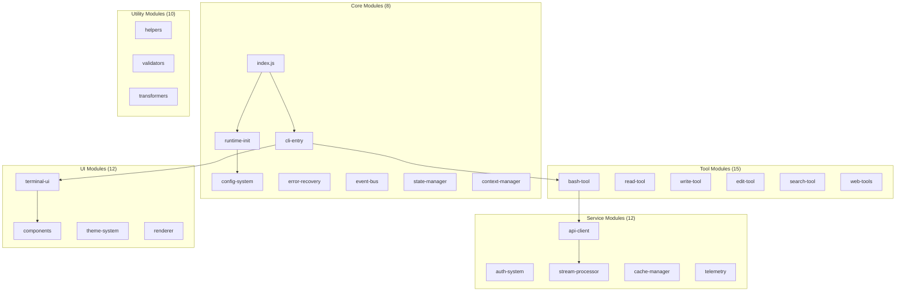

# Part 1.4: Module Organization & Dependencies

## How 71 Modules Create a Cohesive System Architecture

### Dependency Management, Module Boundaries, and Dynamic Loading in Claude Code

---

## 📋 Executive Summary

Claude Code's 40,470 lines of code are meticulously organized into 71 modules with carefully managed dependencies. This deep dive explores the module dependency graph, the distinction between core and peripheral modules, circular dependency resolution strategies, dynamic module loading mechanisms, and bundle optimization techniques that create a maintainable and performant system.

---

## 🗺️ Module Topology Overview



---

## 📊 Module Dependency Analysis

### Dependency Graph Visualization

```javascript
// Module dependency analyzer
class DependencyAnalyzer {
  constructor() {
    this.modules = new Map();
    this.dependencies = new Map();
    this.inverseDependencies = new Map();
    this.circularDependencies = new Set();
  }

  // Analyze module dependencies
  async analyzeModule(modulePath) {
    const module = await this.loadModule(modulePath);
    const ast = await this.parseToAST(module);

    const dependencies = {
      imports: this.extractImports(ast),
      requires: this.extractRequires(ast),
      dynamic: this.extractDynamicImports(ast),
      injected: this.extractInjectedDependencies(ast)
    };

    this.modules.set(modulePath, {
      path: modulePath,
      dependencies,
      exports: this.extractExports(ast),
      metrics: this.calculateMetrics(ast)
    });

    return dependencies;
  }

  // Build complete dependency graph
  buildDependencyGraph() {
    const graph = {
      nodes: [],
      edges: [],
      clusters: new Map()
    };

    // Create nodes
    for (const [path, module] of this.modules) {
      graph.nodes.push({
        id: path,
        label: this.getModuleName(path),
        type: this.getModuleType(module),
        metrics: module.metrics
      });
    }

    // Create edges
    for (const [path, module] of this.modules) {
      for (const dep of this.getAllDependencies(module)) {
        graph.edges.push({
          source: path,
          target: dep,
          type: this.getDependencyType(module, dep)
        });
      }
    }

    // Detect clusters
    graph.clusters = this.detectClusters(graph);

    return graph;
  }

  // Detect circular dependencies
  detectCircularDependencies() {
    const visited = new Set();
    const recursionStack = new Set();
    const cycles = [];

    const dfs = (node, path = []) => {
      visited.add(node);
      recursionStack.add(node);
      path.push(node);

      const deps = this.dependencies.get(node) || [];

      for (const dep of deps) {
        if (!visited.has(dep)) {
          dfs(dep, [...path]);
        } else if (recursionStack.has(dep)) {
          // Found circular dependency
          const cycleStart = path.indexOf(dep);
          const cycle = path.slice(cycleStart);
          cycles.push(cycle);
        }
      }

      recursionStack.delete(node);
    };

    // Run DFS from each unvisited node
    for (const node of this.modules.keys()) {
      if (!visited.has(node)) {
        dfs(node);
      }
    }

    return cycles;
  }

  // Calculate module cohesion and coupling
  calculateCohesionCoupling() {
    const metrics = new Map();

    for (const [path, module] of this.modules) {
      const internalCalls = this.countInternalCalls(module);
      const externalCalls = this.countExternalCalls(module);

      metrics.set(path, {
        cohesion: internalCalls / (internalCalls + externalCalls),
        coupling: this.dependencies.get(path)?.length || 0,
        afferentCoupling: this.inverseDependencies.get(path)?.length || 0,
        instability: this.calculateInstability(path)
      });
    }

    return metrics;
  }

  calculateInstability(modulePath) {
    const efferent = this.dependencies.get(modulePath)?.length || 0;
    const afferent = this.inverseDependencies.get(modulePath)?.length || 0;

    if (efferent + afferent === 0) return 0;

    return efferent / (efferent + afferent);
  }
}
```

### Module Categories & Responsibilities

```javascript
// Module organization structure
const moduleStructure = {
  // Core modules - Essential for system operation
  core: {
    'src/index.js': {
      responsibility: 'Main entry point and exports',
      dependencies: ['runtime', 'cli', 'api'],
      criticalPath: true
    },
    'src/runtime/runtime-initialization.js': {
      responsibility: 'Bootstrap and environment setup',
      dependencies: ['config', 'logging', 'error-handling'],
      criticalPath: true
    },
    'src/cli/cli-entry.js': {
      responsibility: 'Command-line interface entry',
      dependencies: ['commander', 'conversation', 'tools'],
      criticalPath: true
    }
  },

  // Tool modules - User-facing functionality
  tools: {
    'src/tools/bash-tool.js': {
      responsibility: 'Shell command execution',
      dependencies: ['child_process', 'permissions', 'sandbox'],
      security: 'high'
    },
    'src/tools/read-tool.js': {
      responsibility: 'File reading operations',
      dependencies: ['fs', 'path', 'mime-types'],
      security: 'medium'
    },
    'src/tools/edit-tool.js': {
      responsibility: 'File editing operations',
      dependencies: ['fs', 'diff', 'backup'],
      security: 'high'
    }
  },

  // Service modules - External integrations
  services: {
    'src/api/anthropic-client.js': {
      responsibility: 'Anthropic API communication',
      dependencies: ['http', 'streaming', 'auth'],
      external: true
    },
    'src/auth/oauth-flow.js': {
      responsibility: 'OAuth 2.0 authentication',
      dependencies: ['crypto', 'http', 'storage'],
      security: 'critical'
    }
  },

  // UI modules - User interface
  ui: {
    'src/ui/terminal-ui.js': {
      responsibility: 'Terminal interface rendering',
      dependencies: ['ink', 'react', 'components'],
      async: true
    },
    'src/ui/components/spinner.js': {
      responsibility: 'Loading indicators',
      dependencies: ['ink', 'react'],
      reusable: true
    }
  },

  // Utility modules - Shared functionality
  utilities: {
    'src/utils/stream-processing.js': {
      responsibility: 'Stream transformation utilities',
      dependencies: ['stream', 'buffer'],
      performance: 'critical'
    },
    'src/utils/validation.js': {
      responsibility: 'Input validation',
      dependencies: [],
      pure: true
    }
  }
};
```

---

## 🔄 Circular Dependency Resolution

### Detection & Resolution Strategies

```javascript
// Circular dependency resolver
class CircularDependencyResolver {
  constructor() {
    this.resolutionStrategies = new Map([
      ['dependency-injection', this.resolveDI.bind(this)],
      ['lazy-loading', this.resolveLazy.bind(this)],
      ['event-based', this.resolveEvents.bind(this)],
      ['interface-abstraction', this.resolveInterface.bind(this)]
    ]);
  }

  // Strategy 1: Dependency Injection
  resolveDI(moduleA, moduleB) {
    // Instead of direct imports, inject dependencies
    return {
      moduleA: `
        class ModuleA {
          constructor(moduleB = null) {
            this.moduleB = moduleB;
          }

          setModuleB(moduleB) {
            this.moduleB = moduleB;
          }

          useModuleB() {
            if (!this.moduleB) {
              throw new Error('ModuleB not injected');
            }
            return this.moduleB.someMethod();
          }
        }

        module.exports = ModuleA;
      `,

      moduleB: `
        class ModuleB {
          constructor(moduleA = null) {
            this.moduleA = moduleA;
          }

          setModuleA(moduleA) {
            this.moduleA = moduleA;
          }

          useModuleA() {
            if (!this.moduleA) {
              throw new Error('ModuleA not injected');
            }
            return this.moduleA.someMethod();
          }
        }

        module.exports = ModuleB;
      `,

      setup: `
        const ModuleA = require('./moduleA');
        const ModuleB = require('./moduleB');

        const moduleA = new ModuleA();
        const moduleB = new ModuleB();

        moduleA.setModuleB(moduleB);
        moduleB.setModuleA(moduleA);

        module.exports = { moduleA, moduleB };
      `
    };
  }

  // Strategy 2: Lazy Loading
  resolveLazy(moduleA, moduleB) {
    return {
      moduleA: `
        class ModuleA {
          get moduleB() {
            if (!this._moduleB) {
              // Lazy load on first use
              this._moduleB = require('./moduleB');
            }
            return this._moduleB;
          }

          useModuleB() {
            return this.moduleB.someMethod();
          }
        }

        module.exports = ModuleA;
      `
    };
  }

  // Strategy 3: Event-based Communication
  resolveEvents(moduleA, moduleB) {
    return {
      eventBus: `
        const EventEmitter = require('events');

        class EventBus extends EventEmitter {
          constructor() {
            super();
            this.setMaxListeners(100);
          }
        }

        module.exports = new EventBus();
      `,

      moduleA: `
        const eventBus = require('./eventBus');

        class ModuleA {
          constructor() {
            eventBus.on('moduleB:event', this.handleModuleBEvent.bind(this));
          }

          emitToB(data) {
            eventBus.emit('moduleA:event', data);
          }

          handleModuleBEvent(data) {
            // Handle event from ModuleB
          }
        }

        module.exports = ModuleA;
      `
    };
  }

  // Strategy 4: Interface Abstraction
  resolveInterface(moduleA, moduleB) {
    return {
      interface: `
        // Define shared interface
        class SharedInterface {
          methodA() { throw new Error('Not implemented'); }
          methodB() { throw new Error('Not implemented'); }
        }

        module.exports = SharedInterface;
      `,

      moduleA: `
        const SharedInterface = require('./interface');

        class ModuleA extends SharedInterface {
          methodA() {
            // Implementation
          }
        }

        module.exports = ModuleA;
      `
    };
  }

  // Automatic resolution selection
  selectResolutionStrategy(cycle) {
    const modules = cycle.map(path => this.analyzeModule(path));

    // Heuristics for strategy selection
    if (modules.every(m => m.type === 'service')) {
      return 'dependency-injection';
    }

    if (modules.some(m => m.size > 10000)) {
      return 'lazy-loading';
    }

    if (modules.every(m => m.async)) {
      return 'event-based';
    }

    return 'interface-abstraction';
  }
}
```

---

## 🔌 Dynamic Module Loading

### Runtime Module System

```javascript
// Dynamic module loader with caching and validation
class DynamicModuleLoader {
  constructor() {
    this.cache = new Map();
    this.loaders = new Map();
    this.validators = new Map();
    this.transformers = [];
    this.sandbox = new ModuleSandbox();
  }

  // Register custom loader for file type
  registerLoader(extension, loader) {
    this.loaders.set(extension, loader);
  }

  // Dynamic import with validation
  async import(modulePath, options = {}) {
    const {
      cache = true,
      validate = true,
      transform = true,
      sandbox = false
    } = options;

    // Check cache
    if (cache && this.cache.has(modulePath)) {
      return this.cache.get(modulePath);
    }

    try {
      // Load module
      let module = await this.loadModule(modulePath);

      // Apply transformations
      if (transform) {
        module = await this.transformModule(module, modulePath);
      }

      // Validate module
      if (validate) {
        await this.validateModule(module, modulePath);
      }

      // Sandbox if required
      if (sandbox) {
        module = await this.sandboxModule(module, modulePath);
      }

      // Cache module
      if (cache) {
        this.cache.set(modulePath, module);
      }

      return module;
    } catch (error) {
      throw new Error(`Failed to load module ${modulePath}: ${error.message}`);
    }
  }

  // Load module based on type
  async loadModule(modulePath) {
    const extension = path.extname(modulePath);
    const loader = this.loaders.get(extension) || this.defaultLoader;

    return await loader(modulePath);
  }

  // Default CommonJS/ESM loader
  async defaultLoader(modulePath) {
    // Try ESM first
    try {
      return await import(modulePath);
    } catch (esmError) {
      // Fallback to CommonJS
      try {
        return require(modulePath);
      } catch (cjsError) {
        throw new Error(`Module format not supported: ${modulePath}`);
      }
    }
  }

  // Transform module (e.g., TypeScript, JSX)
  async transformModule(module, modulePath) {
    let transformed = module;

    for (const transformer of this.transformers) {
      if (transformer.canTransform(modulePath)) {
        transformed = await transformer.transform(transformed, modulePath);
      }
    }

    return transformed;
  }

  // Validate module structure
  async validateModule(module, modulePath) {
    const validator = this.validators.get(path.dirname(modulePath));

    if (validator) {
      const isValid = await validator.validate(module);

      if (!isValid) {
        throw new Error(`Module validation failed: ${modulePath}`);
      }
    }

    // Basic validation
    if (!module || typeof module !== 'object') {
      throw new Error(`Invalid module structure: ${modulePath}`);
    }
  }

  // Sandbox module execution
  async sandboxModule(module, modulePath) {
    return await this.sandbox.execute(module, {
      permissions: this.getModulePermissions(modulePath),
      timeout: 5000,
      memory: 50 * 1024 * 1024  // 50MB
    });
  }

  // Hot module replacement
  async hotReload(modulePath) {
    // Invalidate cache
    this.cache.delete(modulePath);
    this.invalidateDependents(modulePath);

    // Reload module
    const newModule = await this.import(modulePath, { cache: false });

    // Update references
    await this.updateReferences(modulePath, newModule);

    // Emit reload event
    this.emit('module:reloaded', { path: modulePath, module: newModule });

    return newModule;
  }

  // Invalidate dependent modules
  invalidateDependents(modulePath) {
    const dependents = this.findDependents(modulePath);

    for (const dependent of dependents) {
      this.cache.delete(dependent);

      // Recursively invalidate
      this.invalidateDependents(dependent);
    }
  }
}

// Module sandbox for secure execution
class ModuleSandbox {
  constructor() {
    this.vm = require('vm');
    this.contexts = new Map();
  }

  async execute(module, options) {
    const context = this.createContext(options.permissions);

    const script = new this.vm.Script(`
      (function(exports, require, module, __filename, __dirname) {
        ${module.toString()}
      })
    `);

    const sandbox = {
      exports: {},
      require: this.createSafeRequire(options.permissions),
      module: { exports: {} },
      __filename: 'sandbox.js',
      __dirname: '/sandbox',
      console: this.createSafeConsole(),
      setTimeout: this.createSafeTimer(options.timeout),
      setInterval: this.createSafeTimer(options.timeout),
      process: this.createSafeProcess(options.permissions)
    };

    const result = script.runInNewContext(sandbox, {
      timeout: options.timeout,
      memoryLimit: options.memory
    });

    return sandbox.module.exports || sandbox.exports;
  }

  createSafeRequire(permissions) {
    return (moduleName) => {
      if (!permissions.includes(`require:${moduleName}`)) {
        throw new Error(`Module not allowed: ${moduleName}`);
      }

      // Whitelist of allowed modules
      const allowed = ['path', 'url', 'querystring', 'util'];

      if (allowed.includes(moduleName)) {
        return require(moduleName);
      }

      throw new Error(`Module not in whitelist: ${moduleName}`);
    };
  }
}
```

---

## 📦 Bundle Optimization Strategies

### Code Splitting & Tree Shaking

```javascript
// Bundle optimizer for production builds
class BundleOptimizer {
  constructor() {
    this.chunks = new Map();
    this.entryPoints = new Set();
    this.commonChunks = new Map();
  }

  // Analyze and optimize bundle
  async optimize(modules, config) {
    // Step 1: Analyze module graph
    const graph = await this.analyzeModuleGraph(modules);

    // Step 2: Identify code split points
    const splitPoints = this.identifySplitPoints(graph, config);

    // Step 3: Create chunks
    const chunks = await this.createChunks(graph, splitPoints);

    // Step 4: Extract common chunks
    const optimizedChunks = this.extractCommonChunks(chunks);

    // Step 5: Tree shake unused exports
    const shakenChunks = await this.treeShake(optimizedChunks);

    // Step 6: Minify and compress
    const finalChunks = await this.minifyChunks(shakenChunks);

    return finalChunks;
  }

  // Identify optimal split points
  identifySplitPoints(graph, config) {
    const splitPoints = new Set();

    // Strategy 1: Route-based splitting
    for (const route of config.routes || []) {
      const routeModules = this.findRouteModules(graph, route);
      splitPoints.add({
        type: 'route',
        name: route.name,
        modules: routeModules
      });
    }

    // Strategy 2: Dynamic import splitting
    for (const module of graph.modules) {
      const dynamicImports = module.dynamicImports || [];

      for (const dynamicImport of dynamicImports) {
        splitPoints.add({
          type: 'dynamic',
          name: `dynamic-${dynamicImport}`,
          modules: [dynamicImport]
        });
      }
    }

    // Strategy 3: Vendor splitting
    const vendorModules = graph.modules.filter(m =>
      m.path.includes('node_modules')
    );

    splitPoints.add({
      type: 'vendor',
      name: 'vendor',
      modules: vendorModules.map(m => m.path)
    });

    // Strategy 4: Common chunks
    const commonModules = this.identifyCommonModules(graph, config);

    splitPoints.add({
      type: 'common',
      name: 'common',
      modules: commonModules
    });

    return splitPoints;
  }

  // Create optimized chunks
  createChunks(graph, splitPoints) {
    const chunks = new Map();

    for (const splitPoint of splitPoints) {
      const chunk = {
        name: splitPoint.name,
        type: splitPoint.type,
        modules: new Set(),
        dependencies: new Set(),
        size: 0
      };

      // Add modules to chunk
      for (const modulePath of splitPoint.modules) {
        const module = graph.getModule(modulePath);

        if (module) {
          chunk.modules.add(module);
          chunk.size += module.size;

          // Track dependencies
          for (const dep of module.dependencies) {
            if (!splitPoint.modules.includes(dep)) {
              chunk.dependencies.add(dep);
            }
          }
        }
      }

      chunks.set(chunk.name, chunk);
    }

    return chunks;
  }

  // Extract common modules into shared chunks
  extractCommonChunks(chunks) {
    const moduleUsage = new Map();

    // Count module usage across chunks
    for (const chunk of chunks.values()) {
      for (const module of chunk.modules) {
        const usage = moduleUsage.get(module.path) || new Set();
        usage.add(chunk.name);
        moduleUsage.set(module.path, usage);
      }
    }

    // Extract modules used in multiple chunks
    const commonChunk = {
      name: 'common',
      type: 'common',
      modules: new Set(),
      size: 0
    };

    for (const [modulePath, usage] of moduleUsage) {
      if (usage.size >= 2) {  // Used in 2+ chunks
        const module = this.findModule(chunks, modulePath);

        if (module) {
          commonChunk.modules.add(module);
          commonChunk.size += module.size;

          // Remove from original chunks
          for (const chunkName of usage) {
            const chunk = chunks.get(chunkName);
            chunk.modules.delete(module);
            chunk.size -= module.size;
          }
        }
      }
    }

    if (commonChunk.modules.size > 0) {
      chunks.set('common', commonChunk);
    }

    return chunks;
  }

  // Tree shaking - remove unused exports
  async treeShake(chunks) {
    const usedExports = new Set();

    // Mark all used exports
    for (const chunk of chunks.values()) {
      for (const module of chunk.modules) {
        const imports = await this.analyzeImports(module);

        for (const imp of imports) {
          usedExports.add(`${imp.module}:${imp.export}`);
        }
      }
    }

    // Remove unused exports
    for (const chunk of chunks.values()) {
      for (const module of chunk.modules) {
        const exports = await this.analyzeExports(module);

        for (const exp of exports) {
          const exportId = `${module.path}:${exp.name}`;

          if (!usedExports.has(exportId) && !exp.sideEffects) {
            // Remove unused export
            module.code = this.removeExport(module.code, exp);
            module.size = Buffer.byteLength(module.code);
          }
        }
      }
    }

    return chunks;
  }

  // Minification strategies
  async minifyChunks(chunks) {
    const minified = new Map();

    for (const [name, chunk] of chunks) {
      const minifiedChunk = {
        ...chunk,
        code: await this.minifyCode(chunk),
        sourceMap: await this.generateSourceMap(chunk)
      };

      // Apply additional optimizations
      minifiedChunk.code = await this.applyOptimizations(minifiedChunk.code, {
        removeConsole: true,
        removeDebugger: true,
        inlineConstants: true,
        simplifyConditionals: true
      });

      minified.set(name, minifiedChunk);
    }

    return minified;
  }
}
```

---

## 🎯 Module Loading Strategies

### Progressive Loading Implementation

```javascript
// Progressive module loading system
class ProgressiveLoader {
  constructor() {
    this.priorities = new Map();
    this.loaded = new Set();
    this.loading = new Map();
    this.queue = new PriorityQueue();
  }

  // Define loading strategy
  defineStrategy(config) {
    return {
      // Critical modules - load immediately
      critical: [
        'src/index.js',
        'src/runtime/runtime-initialization.js',
        'src/cli/cli-entry.js'
      ],

      // Core modules - load after critical
      core: [
        'src/conversation/conversation-loop.js',
        'src/api/anthropic-client.js',
        'src/config/configuration-system.js'
      ],

      // Feature modules - load on demand
      features: {
        'tools': [
          'src/tools/bash-tool.js',
          'src/tools/read-tool.js',
          'src/tools/write-tool.js'
        ],
        'ui': [
          'src/ui/terminal-ui.js',
          'src/ui/components/*.js'
        ],
        'plugins': [
          'src/plugins/plugin-system.js',
          'src/hooks/hook-system.js'
        ]
      },

      // Lazy modules - load when needed
      lazy: [
        'src/telemetry/*.js',
        'src/analytics/*.js',
        'src/development/*.js'
      ]
    };
  }

  // Progressive loading implementation
  async load(strategy) {
    // Phase 1: Critical modules (blocking)
    await this.loadCritical(strategy.critical);

    // Phase 2: Core modules (parallel)
    this.loadCore(strategy.core);  // Non-blocking

    // Phase 3: Feature modules (on-demand)
    this.setupFeatureLoading(strategy.features);

    // Phase 4: Lazy modules (background)
    this.scheduleLazyLoading(strategy.lazy);
  }

  async loadCritical(modules) {
    console.log('Loading critical modules...');

    const promises = modules.map(module =>
      this.loadModule(module, { priority: 10 })
    );

    await Promise.all(promises);

    console.log('Critical modules loaded');
  }

  async loadCore(modules) {
    console.log('Loading core modules...');

    // Load in parallel but don't block
    for (const module of modules) {
      this.loadModule(module, { priority: 5 }).catch(error => {
        console.error(`Failed to load core module ${module}:`, error);
      });
    }
  }

  setupFeatureLoading(features) {
    for (const [feature, modules] of Object.entries(features)) {
      // Create feature loader
      this.createFeatureLoader(feature, modules);
    }
  }

  createFeatureLoader(feature, modules) {
    return async () => {
      if (this.loaded.has(feature)) {
        return;
      }

      console.log(`Loading feature: ${feature}`);

      const promises = modules.map(module =>
        this.loadModule(module, { priority: 3 })
      );

      await Promise.all(promises);

      this.loaded.add(feature);

      console.log(`Feature loaded: ${feature}`);
    };
  }

  scheduleLazyLoading(modules) {
    // Schedule lazy loading with idle callback
    if (typeof requestIdleCallback !== 'undefined') {
      requestIdleCallback(() => {
        this.loadLazyModules(modules);
      }, { timeout: 5000 });
    } else {
      // Fallback to setTimeout
      setTimeout(() => {
        this.loadLazyModules(modules);
      }, 5000);
    }
  }

  async loadLazyModules(modules) {
    for (const pattern of modules) {
      const matchedModules = await this.glob(pattern);

      for (const module of matchedModules) {
        this.queue.enqueue({
          module,
          priority: 1,
          load: () => this.loadModule(module, { priority: 1 })
        });
      }
    }

    // Process queue in background
    this.processQueue();
  }

  async processQueue() {
    while (!this.queue.isEmpty()) {
      const task = this.queue.dequeue();

      try {
        await task.load();
      } catch (error) {
        console.warn(`Failed to lazy load ${task.module}:`, error);
      }

      // Yield to other operations
      await new Promise(resolve => setImmediate(resolve));
    }
  }
}
```

---

## 📊 Module Metrics & Analysis

### Complexity & Quality Metrics

```javascript
// Module metrics analyzer
class ModuleMetrics {
  analyze(module) {
    return {
      // Size metrics
      size: {
        lines: this.countLines(module),
        statements: this.countStatements(module),
        functions: this.countFunctions(module),
        classes: this.countClasses(module)
      },

      // Complexity metrics
      complexity: {
        cyclomatic: this.calculateCyclomaticComplexity(module),
        cognitive: this.calculateCognitiveComplexity(module),
        nesting: this.calculateMaxNesting(module),
        parameters: this.calculateMaxParameters(module)
      },

      // Coupling metrics
      coupling: {
        afferent: this.calculateAfferentCoupling(module),
        efferent: this.calculateEfferentCoupling(module),
        instability: this.calculateInstability(module),
        abstractness: this.calculateAbstractness(module)
      },

      // Cohesion metrics
      cohesion: {
        lcom: this.calculateLCOM(module),  // Lack of Cohesion
        relational: this.calculateRelationalCohesion(module),
        functional: this.calculateFunctionalCohesion(module)
      },

      // Maintainability index
      maintainability: this.calculateMaintainabilityIndex(module)
    };
  }

  calculateMaintainabilityIndex(module) {
    const volume = Math.log(module.statements) * Math.log(module.vocabulary);
    const complexity = module.cyclomaticComplexity;
    const lines = module.lines;

    // Microsoft's Maintainability Index formula
    const mi = 171 - 5.2 * Math.log(volume) - 0.23 * complexity - 16.2 * Math.log(lines);

    return Math.max(0, Math.min(100, mi));
  }

  generateReport(modules) {
    const report = {
      summary: {
        totalModules: modules.length,
        totalLines: 0,
        averageComplexity: 0,
        maintainabilityIndex: 0
      },

      problematic: [],
      wellDesigned: [],

      recommendations: []
    };

    for (const module of modules) {
      const metrics = this.analyze(module);

      // Update summary
      report.summary.totalLines += metrics.size.lines;
      report.summary.averageComplexity += metrics.complexity.cyclomatic;
      report.summary.maintainabilityIndex += metrics.maintainability;

      // Identify problematic modules
      if (metrics.complexity.cyclomatic > 10 || metrics.maintainability < 50) {
        report.problematic.push({
          module: module.path,
          issues: this.identifyIssues(metrics)
        });
      }

      // Identify well-designed modules
      if (metrics.maintainability > 80 && metrics.complexity.cyclomatic < 5) {
        report.wellDesigned.push(module.path);
      }
    }

    // Calculate averages
    report.summary.averageComplexity /= modules.length;
    report.summary.maintainabilityIndex /= modules.length;

    // Generate recommendations
    report.recommendations = this.generateRecommendations(report);

    return report;
  }
}
```

---

## 🎯 Key Takeaways

### Module Organization Best Practices

1. **Clear Module Boundaries**
   - Each module has single responsibility
   - Dependencies flow in one direction
   - Interfaces are well-defined

2. **Dependency Management**
   - Minimize coupling between modules
   - Use dependency injection
   - Avoid circular dependencies

3. **Dynamic Loading**
   - Load critical modules first
   - Lazy load optional features
   - Progressive enhancement strategy

4. **Bundle Optimization**
   - Code splitting at logical boundaries
   - Tree shaking removes dead code
   - Common chunks reduce duplication

5. **Module Metrics**
   - Monitor complexity metrics
   - Track coupling and cohesion
   - Maintain high maintainability index

### Architecture Impact

The module organization enables:
- **Maintainability** - Clear structure and boundaries
- **Testability** - Isolated modules for unit testing
- **Performance** - Optimized loading and bundling
- **Scalability** - Easy to add new modules
- **Flexibility** - Modules can be replaced or extended

---

## 📚 Further Reading

- [Part 2.1 - The Bootstrap Sequence](../part-02-runtime/01-bootstrap-sequence.md)
- [Part 4.1 - Tool Architecture Overview](../part-04-tools/01-tool-architecture.md)
- [Part 9.2 - Build System](../part-09-development/02-build-system.md)
- [Part 11.1 - Plugin System Architecture](../part-11-extensibility/01-plugin-architecture.md)

---

*This article is part of the Claude Code Internals series - exploring the modular architecture that enables Claude Code CLI's flexibility and performance*