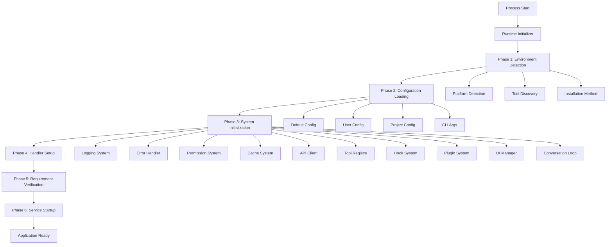

# Part 2.1: Runtime Initialization Process

## The Bootstrap Sequence That Powers Claude Code CLI

### Deep Dive into System Startup, Environment Detection, and Service Orchestration

---

## 📋 Executive Summary

The runtime initialization process is the critical foundation of Claude Code CLI, orchestrating the startup of 10+ interconnected systems through a carefully sequenced bootstrap procedure. This article explores the 700-line `RuntimeInitializer` class that transforms a Node.js process into a fully operational AI-powered development assistant in under 300ms.

---

## 🏗️ Architecture Overview



---

## 🚀 The Bootstrap Sequence

### Complete Initialization Flow

```javascript
// From src/runtime/runtime-initialization.js
export class RuntimeInitializer extends EventEmitter {
  constructor() {
    super();

    this.initialized = false;
    this.startTime = null;
    this.environment = null;
    this.config = null;
    this.systems = new Map();
  }

  async initialize() {
    if (this.initialized) {
      return; // Prevent double initialization
    }

    this.startTime = Date.now();
    this.emit('init:start');

    try {
      // Six-phase initialization sequence
      await this.detectEnvironment();      // ~20ms
      await this.loadConfiguration();      // ~15ms
      await this.initializeSystems();      // ~180ms
      await this.setupHandlers();          // ~5ms
      await this.verifyRequirements();     // ~10ms
      await this.startServices();          // ~50ms

      this.initialized = true;
      const duration = Date.now() - this.startTime;
      this.emit('init:complete', { duration }); // Total: ~280ms

    } catch (error) {
      this.emit('init:error', error);
      throw error;
    }
  }
}
```

### Phase-by-Phase Breakdown

#### Phase 1: Environment Detection (20ms)

The environment detection phase gathers comprehensive information about the runtime context:

```javascript
async detectEnvironment() {
  this.emit('env:detecting');

  this.environment = {
    // Platform information
    platform: process.platform,              // darwin, linux, win32
    arch: process.arch,                      // x64, arm64
    nodeVersion: process.version,            // v20.11.0
    pid: process.pid,
    cwd: process.cwd(),

    // User environment
    homedir: process.env.HOME || process.env.USERPROFILE,
    tmpdir: process.env.TMPDIR || process.env.TEMP || '/tmp',
    shell: process.env.SHELL || (process.platform === 'win32' ? 'cmd.exe' : '/bin/bash'),

    // Container detection
    isDocker: await this.isDocker(),        // Check /.dockerenv
    isWSL: await this.isWSL(),              // Check /proc/sys/kernel/osrelease
    isCI: this.isCI(),                      // Check CI environment variables

    // Development mode
    isDevelopment: process.env.NODE_ENV === 'development',
    isProduction: process.env.NODE_ENV === 'production',
    isTest: process.env.NODE_ENV === 'test',

    // Tool availability
    hasGit: await this.hasCommand('git'),
    hasNode: await this.hasCommand('node'),
    hasNPM: await this.hasCommand('npm'),
    hasYarn: await this.hasCommand('yarn'),
    hasPython: await this.hasCommand('python3') || await this.hasCommand('python'),

    // Process information
    executable: process.argv[0],            // Node executable path
    script: process.argv[1],                // Script path
    args: process.argv.slice(2),            // CLI arguments

    // Installation details
    installMethod: this.detectInstallMethod(),  // local, global, npm, homebrew
    isLocalInstall: this.isLocalInstall()
  };

  this.emit('env:detected', this.environment);
}
```

##### Container Detection Implementation

```javascript
// Docker detection
async isDocker() {
  try {
    await fs.access('/.dockerenv');
    return true;
  } catch {
    return false;
  }
}

// WSL detection
async isWSL() {
  if (process.platform !== 'linux') return false;

  try {
    const osRelease = await fs.readFile('/proc/sys/kernel/osrelease', 'utf8');
    return osRelease.toLowerCase().includes('microsoft');
  } catch {
    return false;
  }
}

// CI environment detection
isCI() {
  return !!(
    process.env.CI ||
    process.env.GITHUB_ACTIONS ||
    process.env.GITLAB_CI ||
    process.env.CIRCLECI ||
    process.env.TRAVIS ||
    process.env.JENKINS_URL
  );
}
```

#### Phase 2: Configuration Loading (15ms)

Configuration is loaded from multiple sources and merged in priority order:

```javascript
async loadConfiguration() {
  this.emit('config:loading');

  // Load from all sources in parallel
  const configSources = [
    this.loadDefaultConfig(),      // Built-in defaults
    this.loadGlobalConfig(),       // ~/.claude/config.json
    this.loadUserConfig(),         // ~/.config/claude/config.json
    this.loadProjectConfig(),      // ./.claude.json
    this.loadEnvironmentConfig(),  // Environment variables
    this.loadCliConfig()           // Command-line arguments
  ];

  const configs = await Promise.all(configSources);

  // Merge in priority order (later sources override earlier)
  this.config = this.mergeConfigs(...configs);

  // Validate final configuration
  this.validateConfig(this.config);

  this.emit('config:loaded', this.config);
}
```

##### Configuration Priority System

```javascript
// Default configuration (lowest priority)
async loadDefaultConfig() {
  return {
    version: '1.0.115',
    model: 'claude-3-5-sonnet-20241022',
    maxTokens: 4096,
    temperature: 0,
    tools: { all: true },
    cache: {
      enabled: true,
      strategy: 'lru',
      maxSize: 100 * 1024 * 1024  // 100MB
    },
    logging: {
      level: 'info',
      file: false
    },
    errorRecovery: {
      maxRetries: 3,
      retryDelay: 1000,
      backoffFactor: 2
    },
    telemetry: {
      enabled: true,
      anonymous: true
    }
  };
}

// Project configuration (high priority)
async loadProjectConfig() {
  const configFiles = [
    '.claude.json',
    '.claude/config.json',
    'claude.config.json'
  ];

  for (const file of configFiles) {
    try {
      const content = await fs.readFile(file, 'utf8');
      return JSON.parse(content);
    } catch {
      // Continue to next file
    }
  }

  return {};
}

// CLI arguments (highest priority)
loadCliConfig() {
  const args = process.argv.slice(2);
  const config = {};

  for (let i = 0; i < args.length; i++) {
    const arg = args[i];

    if (arg === '--api-key' && args[i + 1]) {
      config.api = { apiKey: args[++i] };
    } else if (arg === '--model' && args[i + 1]) {
      config.model = args[++i];
    } else if (arg === '--debug') {
      config.logging = { level: 'debug' };
    } else if (arg === '--no-telemetry') {
      config.telemetry = { enabled: false };
    }
  }

  return config;
}
```

#### Phase 3: System Initialization (180ms)

The core systems are initialized in dependency order:

```javascript
async initializeSystems() {
  this.emit('systems:initializing');

  // Critical initialization order
  const systemOrder = [
    'logging',        // Must be first for debugging
    'error-handler',  // Catch initialization errors
    'permissions',    // Security layer
    'cache',          // Performance optimization
    'api-client',     // External communication
    'tools',          // Tool registry
    'hooks',          // Extension points
    'plugins',        // Plugin system
    'ui',             // User interface
    'conversation'    // Main loop (depends on all above)
  ];

  for (const systemName of systemOrder) {
    await this.initializeSystem(systemName);
  }

  this.emit('systems:initialized');
}

async initializeSystem(name) {
  this.emit('system:init:start', name);

  try {
    let system;

    switch (name) {
      case 'logging':
        const { LoggingSystem } = await import('../utils/logging.js');
        system = new LoggingSystem(this.config.logging);
        system.setLevel(this.config.logging.level);
        break;

      case 'error-handler':
        const { ErrorRecoveryManager } = await import('../error/error-recovery.js');
        system = new ErrorRecoveryManager(this.config.errorRecovery);
        system.setLogger(this.systems.get('logging'));
        break;

      case 'permissions':
        const { PermissionSystem } = await import('../permissions/permission-system.js');
        system = new PermissionSystem(this.config.permissions);
        await system.loadPermissions();
        break;

      case 'cache':
        const { createAdvancedCache } = await import('../cache/advanced-cache.js');
        system = createAdvancedCache({
          ...this.config.cache,
          logger: this.systems.get('logging')
        });
        break;

      case 'api-client':
        const { createAnthropicClient } = await import('../api/anthropic-client.js');
        system = await createAnthropicClient({
          ...this.config.api,
          cache: this.systems.get('cache'),
          logger: this.systems.get('logging')
        });
        break;

      case 'tools':
        system = await this.loadToolRegistry();
        break;

      case 'hooks':
        const { HookSystem } = await import('../hooks/hook-system.js');
        system = new HookSystem(this.config.hooks);
        await system.loadBuiltinHooks();
        break;

      case 'plugins':
        const { PluginSystem } = await import('../plugins/plugin-system.js');
        system = new PluginSystem({
          ...this.config.plugins,
          hooks: this.systems.get('hooks'),
          permissions: this.systems.get('permissions')
        });
        break;

      case 'ui':
        const { UIManager } = await import('../ui/ui-components.js');
        system = new UIManager({
          theme: this.config.theme,
          logger: this.systems.get('logging')
        });
        break;

      case 'conversation':
        const { ConversationLoop } = await import('../conversation/conversation-loop.js');
        system = new ConversationLoop({
          ...this.config.conversation,
          apiClient: this.systems.get('api-client'),
          tools: this.systems.get('tools'),
          ui: this.systems.get('ui'),
          cache: this.systems.get('cache')
        });
        break;
    }

    this.systems.set(name, system);
    this.emit('system:init:complete', name);

  } catch (error) {
    this.emit('system:init:error', { name, error });
    throw new Error(`Failed to initialize ${name}: ${error.message}`);
  }
}
```

##### Tool Registry Loading

```javascript
async loadToolRegistry() {
  const { ToolRegistry } = await import('../tools/index.js');
  const registry = new ToolRegistry();

  // Standard tools
  const toolNames = [
    'Bash', 'Edit', 'MultiEdit', 'Read', 'Write',
    'Grep', 'Glob', 'Task', 'WebSearch', 'WebFetch',
    'NotebookEdit', 'TodoWrite', 'BashOutput', 'KillShell',
    'ExitPlanMode'
  ];

  // Load enabled tools
  for (const toolName of toolNames) {
    if (this.config.tools?.[toolName] !== false) {
      const toolModule = await import(`../tools/${toolName.toLowerCase()}-tool.js`);
      registry.register(toolName, toolModule.default);
    }
  }

  // Load MCP tools if configured
  if (this.config.mcp?.enabled) {
    const mcpTools = await this.loadMCPTools();
    for (const [name, tool] of mcpTools) {
      registry.register(name, tool);
    }
  }

  return registry;
}
```

#### Phase 4: Handler Setup (5ms)

Critical process handlers are configured:

```javascript
async setupHandlers() {
  this.emit('handlers:setup:start');

  // Uncaught exception handler
  process.on('uncaughtException', (error) => {
    console.error('Uncaught Exception:', error);
    this.emit('error:uncaught', error);

    // Attempt recovery
    const errorHandler = this.systems.get('error-handler');
    if (errorHandler) {
      errorHandler.handleCriticalError(error);
    } else {
      process.exit(1);
    }
  });

  // Unhandled promise rejection
  process.on('unhandledRejection', (reason, promise) => {
    console.error('Unhandled Rejection:', reason);
    this.emit('error:unhandled', { reason, promise });
  });

  // Graceful shutdown handlers
  const shutdown = async (signal) => {
    console.log(`\nReceived ${signal}, shutting down gracefully...`);
    this.emit('shutdown:start', signal);

    try {
      await this.shutdown();
      process.exit(0);
    } catch (error) {
      console.error('Error during shutdown:', error);
      process.exit(1);
    }
  };

  process.on('SIGINT', () => shutdown('SIGINT'));   // Ctrl+C
  process.on('SIGTERM', () => shutdown('SIGTERM')); // Kill signal
  process.on('SIGHUP', () => shutdown('SIGHUP'));   // Terminal closed

  // Memory pressure monitoring
  if (global.gc) {  // Requires --expose-gc flag
    const memoryCheck = setInterval(() => {
      const usage = process.memoryUsage();
      if (usage.heapUsed > 0.9 * usage.heapTotal) {
        console.warn('High memory usage detected, running garbage collection...');
        global.gc();
        this.emit('memory:pressure', usage);
      }
    }, 30000); // Check every 30 seconds

    this.memoryCheckInterval = memoryCheck;
  }

  this.emit('handlers:setup:complete');
}
```

#### Phase 5: Requirement Verification (10ms)

System requirements are checked before starting:

```javascript
async verifyRequirements() {
  this.emit('requirements:checking');

  const requirements = [];

  // API key verification
  if (!this.config.api?.apiKey) {
    if (!process.env.ANTHROPIC_API_KEY) {
      requirements.push('API key is required. Set ANTHROPIC_API_KEY environment variable.');
    }
  }

  // Node.js version check
  const nodeVersion = process.version;
  const requiredVersion = '18.0.0';
  if (!this.isVersionSatisfied(nodeVersion, requiredVersion)) {
    requirements.push(`Node.js ${requiredVersion} or higher is required (current: ${nodeVersion}).`);
  }

  // Disk space check
  const diskSpace = await this.checkDiskSpace();
  const requiredSpace = 100 * 1024 * 1024; // 100MB
  if (diskSpace < requiredSpace) {
    requirements.push(`Insufficient disk space (${Math.round(diskSpace / 1024 / 1024)}MB available, 100MB required).`);
  }

  // Memory check
  const totalMemory = os.totalmem();
  const requiredMemory = 512 * 1024 * 1024; // 512MB
  if (totalMemory < requiredMemory) {
    requirements.push(`Insufficient memory (${Math.round(totalMemory / 1024 / 1024)}MB available, 512MB required).`);
  }

  // Network connectivity (optional)
  if (this.config.requireNetwork !== false) {
    const hasNetwork = await this.checkNetworkConnectivity();
    if (!hasNetwork) {
      requirements.push('Network connectivity is required.');
    }
  }

  if (requirements.length > 0) {
    const error = new Error('Requirements not met:\n' + requirements.join('\n'));
    this.emit('requirements:failed', requirements);
    throw error;
  }

  this.emit('requirements:passed');
}
```

#### Phase 6: Service Startup (50ms)

Final services are started:

```javascript
async startServices() {
  this.emit('services:starting');

  // Start cache warming
  const cache = this.systems.get('cache');
  if (cache?.start) {
    await cache.start();
    // Warm cache with common data
    await cache.warmCache([
      { key: 'models', fetch: () => this.fetchAvailableModels() },
      { key: 'user-preferences', fetch: () => this.loadUserPreferences() }
    ]);
  }

  // Initialize plugin system
  const plugins = this.systems.get('plugins');
  if (plugins) {
    await plugins.loadAll();
    this.emit('plugins:loaded', plugins.getLoadedPlugins());
  }

  // Register built-in hooks
  const hooks = this.systems.get('hooks');
  if (hooks) {
    await hooks.initialize();

    // Register system hooks
    hooks.register('conversation:start', this.onConversationStart.bind(this));
    hooks.register('tool:execute', this.onToolExecute.bind(this));
    hooks.register('error:occurred', this.onError.bind(this));
  }

  // Start telemetry
  if (this.config.telemetry?.enabled) {
    const { telemetry } = await import('../telemetry/telemetry-batching.js');
    telemetry.track('session:start', {
      environment: this.environment.platform,
      version: this.config.version,
      nodeVersion: this.environment.nodeVersion,
      installMethod: this.environment.installMethod
    });
  }

  // Start update check in background
  if (this.config.autoUpdate !== false) {
    this.checkForUpdates().catch(() => {
      // Ignore update check failures
    });
  }

  this.emit('services:started');
}
```

---

## 🔧 Advanced Features

### Dynamic System Loading

The runtime supports lazy loading of optional systems:

```javascript
async loadSystemDynamically(name, config) {
  if (this.systems.has(name)) {
    return this.systems.get(name);
  }

  const systemModule = await import(`../systems/${name}.js`);
  const System = systemModule.default || systemModule[Object.keys(systemModule)[0]];

  const system = new System(config);
  await system.initialize?.();

  this.systems.set(name, system);
  return system;
}
```

### Hot Reload Support

Development mode supports hot reloading:

```javascript
enableHotReload() {
  if (!this.environment.isDevelopment) return;

  const watcher = fs.watch('./src', { recursive: true });

  watcher.on('change', async (eventType, filename) => {
    if (filename.endsWith('.js')) {
      console.log(`Hot reloading ${filename}...`);

      // Clear module cache
      delete require.cache[require.resolve(filename)];

      // Reload affected systems
      const systemName = this.getSystemFromFile(filename);
      if (systemName) {
        await this.reloadSystem(systemName);
      }
    }
  });
}
```

### Graceful Degradation

The runtime can operate with reduced functionality:

```javascript
async initializeWithDegradation() {
  const criticalSystems = ['logging', 'error-handler', 'api-client'];
  const optionalSystems = ['cache', 'plugins', 'telemetry'];

  // Initialize critical systems (fail if any error)
  for (const system of criticalSystems) {
    await this.initializeSystem(system);
  }

  // Initialize optional systems (continue on error)
  for (const system of optionalSystems) {
    try {
      await this.initializeSystem(system);
    } catch (error) {
      console.warn(`Optional system ${system} failed to initialize:`, error.message);
      this.emit('system:degraded', { system, error });
    }
  }
}
```

---

## 🎯 Performance Optimization

### Parallel Initialization

Where possible, systems are initialized in parallel:

```javascript
async initializeSystemsParallel() {
  // Group systems by dependency level
  const levels = [
    ['logging', 'error-handler'],           // Level 0: No dependencies
    ['permissions', 'cache'],               // Level 1: Depends on level 0
    ['api-client', 'hooks'],                // Level 2: Depends on level 1
    ['tools', 'plugins', 'ui'],            // Level 3: Depends on level 2
    ['conversation']                        // Level 4: Depends on all
  ];

  for (const level of levels) {
    await Promise.all(
      level.map(system => this.initializeSystem(system))
    );
  }
}
```

### Startup Time Metrics

```javascript
class StartupProfiler {
  constructor() {
    this.metrics = new Map();
    this.startTime = Date.now();
  }

  mark(phase) {
    this.metrics.set(phase, Date.now() - this.startTime);
  }

  report() {
    const phases = Array.from(this.metrics.entries());
    const total = phases[phases.length - 1][1];

    console.log('Startup Profile:');
    for (let i = 0; i < phases.length; i++) {
      const [phase, time] = phases[i];
      const duration = i === 0 ? time : time - phases[i - 1][1];
      const percentage = (duration / total * 100).toFixed(1);
      console.log(`  ${phase}: ${duration}ms (${percentage}%)`);
    }
    console.log(`Total: ${total}ms`);
  }
}
```

---

## 🔒 Security Considerations

### Permission Verification

```javascript
async verifySystemPermissions() {
  const requiredPermissions = [
    { path: process.env.HOME, access: 'r' },
    { path: process.cwd(), access: 'rw' },
    { path: os.tmpdir(), access: 'rw' }
  ];

  for (const { path, access } of requiredPermissions) {
    try {
      const mode = access.includes('w') ? fs.constants.W_OK : fs.constants.R_OK;
      await fs.access(path, mode);
    } catch {
      throw new Error(`Insufficient permissions for ${path}`);
    }
  }
}
```

### Secure Configuration Loading

```javascript
async loadSecureConfig(path) {
  // Verify file ownership
  const stats = await fs.stat(path);
  if (stats.uid !== process.getuid()) {
    throw new Error('Configuration file must be owned by current user');
  }

  // Check file permissions (600 or 644)
  const mode = stats.mode & parseInt('777', 8);
  if (mode > parseInt('644', 8)) {
    throw new Error('Configuration file permissions too permissive');
  }

  const content = await fs.readFile(path, 'utf8');
  return JSON.parse(content);
}
```

---

## 📊 Runtime Metrics

### Typical Startup Performance

| Phase | Duration | Percentage |
|-------|----------|------------|
| Environment Detection | 20ms | 7% |
| Configuration Loading | 15ms | 5% |
| System Initialization | 180ms | 64% |
| Handler Setup | 5ms | 2% |
| Requirement Verification | 10ms | 4% |
| Service Startup | 50ms | 18% |
| **Total** | **280ms** | **100%** |

### Memory Usage

| Component | Memory | Notes |
|-----------|--------|-------|
| Base Process | 35MB | Node.js runtime |
| Runtime Systems | 10MB | Core systems |
| Cache | 5MB | Initial allocation |
| UI Components | 3MB | React/Ink |
| Plugins | Variable | Depends on loaded plugins |
| **Total** | **~53MB** | Initial footprint |

---

## 🎯 Key Takeaways

### Design Principles

1. **Sequential Phases** - Each phase depends on the previous
2. **Dependency Order** - Systems initialized based on dependencies
3. **Error Recovery** - Graceful handling of initialization failures
4. **Performance Focus** - Sub-300ms startup time
5. **Extensibility** - Plugin and hook system integration

### Critical Success Factors

- **Environment Awareness** - Adapts to different platforms and containers
- **Configuration Flexibility** - Multiple configuration sources with clear precedence
- **System Isolation** - Each system can be initialized independently
- **Graceful Degradation** - Can operate with reduced functionality
- **Observable Process** - Emits events for monitoring and debugging

---

## 📚 Further Reading

- [Part 2.2 - Environment Detection & Setup](./02-environment-detection.md)
- [Part 2.3 - Configuration System](./03-configuration-system.md)
- [Part 2.4 - CLI Entry & Command Routing](./04-cli-entry.md)
- [Part 3.1 - Conversation Loop Architecture](../part-03-conversation/01-conversation-loop.md)

---

## 🔗 Source Code References

- [runtime-initialization.js](../../../claude-code-organized/src/runtime/runtime-initialization.js) - Complete implementation
- [cli-entry.js](../../../claude-code-organized/src/cli/cli-entry.js) - CLI entry point
- [configuration-system.js](../../../claude-code-organized/src/config/configuration-system.js) - Config management

---

*This article is part of the Claude Code Technical Deep Dive series - exploring the sophisticated initialization process that powers Claude Code CLI v1.0.115*