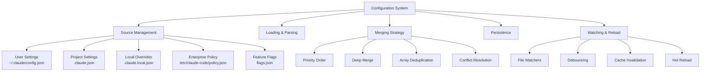

# Part 2.3: Configuration System Implementation

## Multi-Source Configuration Management with Priority Merging

### How Claude Code Manages Settings Across User, Project, and Enterprise Levels

---

## 📋 Executive Summary

Claude Code's configuration system implements a sophisticated multi-source, priority-based configuration management system that merges settings from 5 different sources. This deep dive explores the 440-line implementation that handles user preferences, project settings, enterprise policies, and feature flags with automatic migration, validation, and hot reloading capabilities.

---

## 🏗️ Configuration Architecture



---

## 📂 Configuration Sources

### Five-Tier Configuration Hierarchy

```javascript
// From src/config/configuration-system.js
const CONFIG_SOURCES = [
  'userSettings',     // User-level settings (~/.claude/config.json)
  'projectSettings',  // Project-specific settings (.claude.json)
  'localSettings',    // Local project overrides (.claude.local.json)
  'policySettings',   // Organization/enterprise policies (/etc/claude-code/policy.json)
  'flagSettings'      // Feature flags (flags.json)
];

// Configuration file mapping
const CONFIG_FILES = {
  userSettings: 'config.json',
  projectSettings: '.claude.json',
  localSettings: '.claude.local.json',
  policySettings: 'policy.json',
  flagSettings: 'flags.json'
};
```

### Configuration Path Resolution

```javascript
function getConfigPath(source) {
  switch (source) {
    case 'userSettings':
      // User home directory configuration
      return join(getUserConfigDirectory(), CONFIG_FILES[source]);

    case 'projectSettings':
    case 'localSettings':
      // Project root configuration
      return join(getCurrentWorkingDirectory(), CONFIG_FILES[source]);

    case 'policySettings':
      // System-wide policy location
      return getPolicyPath();

    case 'flagSettings':
      // Feature flags directory (environment variable)
      const flagDir = getFlagDirectory();
      return flagDir ? join(flagDir, CONFIG_FILES[source]) : null;

    default:
      return null;
  }
}

// Platform-specific policy paths
function getPolicyPath() {
  const platform = process.platform;

  switch (platform) {
    case 'darwin':
      return '/Library/Application Support/ClaudeCode/policy.json';

    case 'win32':
      return 'C:\\ProgramData\\ClaudeCode\\policy.json';

    default: // Linux and others
      return '/etc/claude-code/policy.json';
  }
}

// User configuration directory
function getUserConfigDirectory() {
  const home = process.env.HOME || process.env.USERPROFILE;
  return join(home, '.claude');
}

// Feature flags directory (optional)
function getFlagDirectory() {
  return process.env.CLAUDE_FLAGS_DIR || null;
}
```

---

## 🔄 Configuration Loading

### Safe Configuration Loading with Validation

```javascript
function loadConfig(source) {
  const configPath = getConfigPath(source);

  if (!configPath || !fs.existsSync(configPath)) {
    return null;
  }

  try {
    const content = fs.readFileSync(configPath, 'utf8');
    const parsed = JSON.parse(content);

    // Validate the configuration
    if (!validateConfig(parsed)) {
      console.error(`Invalid configuration in ${configPath}`);
      return null;
    }

    // Apply source-specific transformations
    return transformConfigForSource(parsed, source);

  } catch (error) {
    console.error(`Failed to load config from ${configPath}:`, error);
    return null;
  }
}

// Configuration validation
function validateConfig(config) {
  if (!config || typeof config !== 'object') {
    return false;
  }

  // Validate specific fields
  const validations = [
    validateApiConfiguration,
    validateToolConfiguration,
    validatePermissionConfiguration,
    validateModelConfiguration
  ];

  for (const validator of validations) {
    if (!validator(config)) {
      return false;
    }
  }

  return true;
}

// Validate API configuration
function validateApiConfiguration(config) {
  if (!config.api) return true; // Optional

  const api = config.api;

  // Validate API key format if present
  if (api.apiKey && typeof api.apiKey !== 'string') {
    return false;
  }

  // Validate base URL if present
  if (api.baseUrl) {
    try {
      new URL(api.baseUrl);
    } catch {
      return false;
    }
  }

  // Validate timeout
  if (api.timeout && (typeof api.timeout !== 'number' || api.timeout < 0)) {
    return false;
  }

  return true;
}

// Validate model configuration
function validateModelConfiguration(config) {
  if (!config.model) return true;

  const validModels = [
    'claude-3-5-sonnet-20241022',
    'claude-3-opus-20240229',
    'claude-3-sonnet-20240229',
    'claude-3-haiku-20240307'
  ];

  if (!validModels.includes(config.model)) {
    console.warn(`Unknown model: ${config.model}`);
  }

  return true;
}
```

---

## 🔀 Configuration Merging

### Deep Merge with Priority System

```javascript
function getMergedConfiguration() {
  // Return cached if available
  if (configCache !== null) {
    return configCache;
  }

  let merged = {};
  const loadedConfigs = [];
  const seenPaths = new Set();

  // Load configurations in priority order (lowest to highest)
  for (const source of CONFIG_SOURCES) {
    const configPath = getConfigPath(source);

    if (!configPath) continue;

    const normalized = normalizePath(configPath);

    // Skip if already loaded (for deduplication)
    if (seenPaths.has(normalized)) continue;

    seenPaths.add(normalized);

    const config = loadConfig(source);

    if (config) {
      // Apply source priority weights
      const priority = getSourcePriority(source);
      loadedConfigs.push({ source, config, priority });
    }
  }

  // Sort by priority and merge
  loadedConfigs.sort((a, b) => a.priority - b.priority);

  for (const { config, source } of loadedConfigs) {
    merged = mergeConfigurations(merged, config, source);
  }

  // Apply configuration migrations
  merged = migrateConfiguration(merged);

  // Apply policy constraints
  merged = applyPolicyConstraints(merged);

  // Cache the result
  configCache = merged;

  return merged;
}

// Source priority levels
function getSourcePriority(source) {
  const priorities = {
    'flagSettings': 1,      // Lowest - feature flags
    'policySettings': 2,    // Enterprise policies
    'userSettings': 3,      // User preferences
    'projectSettings': 4,   // Project configuration
    'localSettings': 5      // Highest - local overrides
  };

  return priorities[source] || 0;
}
```

### Intelligent Deep Merge

```javascript
function mergeConfigurations(base, override, source) {
  const result = { ...base };

  for (const [key, value] of Object.entries(override)) {
    // Handle special merge strategies
    const strategy = getMergeStrategy(key, source);

    switch (strategy) {
      case 'replace':
        // Complete replacement
        result[key] = value;
        break;

      case 'append':
        // Append to arrays
        result[key] = [...(result[key] || []), ...value];
        break;

      case 'merge':
        // Deep merge objects
        if (value && typeof value === 'object' && !Array.isArray(value)) {
          result[key] = mergeConfigurations(result[key] || {}, value, source);
        } else {
          result[key] = value;
        }
        break;

      case 'union':
        // Union for arrays (deduplicated)
        result[key] = mergeArrays(result[key], value);
        break;

      case 'delete':
        // Remove if undefined
        if (value === undefined) {
          delete result[key];
        }
        break;

      default:
        // Default: override
        result[key] = value;
    }
  }

  return result;
}

// Determine merge strategy for a key
function getMergeStrategy(key, source) {
  // Policy settings have special rules
  if (source === 'policySettings') {
    if (key === 'permissions') return 'replace'; // Policies override permissions
    if (key === 'tools') return 'merge';         // Merge tool configurations
  }

  // Standard strategies by key
  const strategies = {
    'permissions': 'merge',
    'tools': 'merge',
    'hooks': 'append',
    'plugins': 'union',
    'env': 'merge',
    'features': 'merge'
  };

  return strategies[key] || 'replace';
}

// Merge arrays with deduplication
function mergeArrays(base, override) {
  const combined = [...(base || []), ...override];
  return Array.from(new Set(combined));
}
```

---

## 💾 Configuration Persistence

### Safe Configuration Saving

```javascript
function saveConfig(source, config) {
  // Validate source can be saved
  if (!canSaveSource(source)) {
    return {
      error: `Cannot save to ${source}: read-only source`
    };
  }

  const configPath = getConfigPath(source);

  if (!configPath) {
    return { error: 'Invalid configuration source' };
  }

  try {
    const dir = dirname(configPath);

    // Create directory if it doesn't exist
    if (!fs.existsSync(dir)) {
      fs.mkdirSync(dir, { recursive: true });
    }

    // Load existing config for partial updates
    const existing = loadConfig(source) || {};

    // Merge with existing (preserving unmodified fields)
    const merged = mergeConfigurations(existing, config, source);

    // Validate before saving
    if (!validateConfig(merged)) {
      return { error: 'Configuration validation failed' };
    }

    // Create backup of existing config
    if (fs.existsSync(configPath)) {
      const backupPath = `${configPath}.backup`;
      fs.copyFileSync(configPath, backupPath);
    }

    // Write configuration atomically
    const tempPath = `${configPath}.tmp`;
    fs.writeFileSync(
      tempPath,
      JSON.stringify(merged, null, 2),
      'utf8'
    );

    // Atomic rename
    fs.renameSync(tempPath, configPath);

    // Clear cache on save
    clearConfigCache();

    // Emit configuration change event
    emitConfigChange(source, merged);

    return { error: null, config: merged };

  } catch (error) {
    console.error(`Failed to save config to ${configPath}:`, error);
    return { error: error.message };
  }
}

// Check if source can be saved
function canSaveSource(source) {
  // Policy and flag settings are read-only
  const readOnlySources = ['policySettings', 'flagSettings'];
  return !readOnlySources.includes(source);
}

// Clear configuration cache
function clearConfigCache() {
  configCache = null;
}
```

---

## 🔄 Configuration Migration

### Automatic Configuration Updates

```javascript
function migrateConfiguration(config) {
  let migrated = { ...config };
  let version = migrated.configVersion || 0;

  // Apply migrations sequentially
  const migrations = [
    migrateV0ToV1,
    migrateV1ToV2,
    migrateV2ToV3
  ];

  for (let i = version; i < migrations.length; i++) {
    migrated = migrations[i](migrated);
  }

  // Update version
  migrated.configVersion = migrations.length;

  return migrated;
}

// Migration: v0 to v1 - Rename legacy keys
function migrateV0ToV1(config) {
  const migrated = { ...config };

  // Migrate 'allowedTools' to 'permissions'
  if ('allowedTools' in migrated && !('permissions' in migrated)) {
    migrated.permissions = {
      tools: {
        allow: migrated.allowedTools || []
      }
    };
    delete migrated.allowedTools;
  }

  // Migrate 'ignorePatterns' to permissions
  if ('ignorePatterns' in migrated) {
    migrated.permissions = migrated.permissions || {};
    migrated.permissions.paths = {
      deny: migrated.ignorePatterns || []
    };
    delete migrated.ignorePatterns;
  }

  return migrated;
}

// Migration: v1 to v2 - Update model names
function migrateV1ToV2(config) {
  const migrated = { ...config };

  // Update old model names
  const modelMigration = {
    'claude-2': 'claude-3-5-sonnet-20241022',
    'claude-instant': 'claude-3-haiku-20240307',
    'claude-v1': 'claude-3-opus-20240229'
  };

  if (migrated.model && modelMigration[migrated.model]) {
    migrated.model = modelMigration[migrated.model];
  }

  return migrated;
}

// Migration: v2 to v3 - Restructure tools configuration
function migrateV2ToV3(config) {
  const migrated = { ...config };

  // Migrate flat tool list to categorized structure
  if (migrated.tools && Array.isArray(migrated.tools)) {
    const toolCategories = {
      filesystem: ['Read', 'Write', 'Edit', 'MultiEdit'],
      execution: ['Bash', 'BashOutput', 'KillShell'],
      search: ['Grep', 'Glob', 'WebSearch', 'WebFetch'],
      special: ['Task', 'NotebookEdit', 'TodoWrite']
    };

    const oldTools = migrated.tools;
    migrated.tools = {};

    for (const [category, tools] of Object.entries(toolCategories)) {
      migrated.tools[category] = tools.filter(tool =>
        oldTools.includes(tool)
      );
    }
  }

  return migrated;
}
```

---

## 👀 Configuration Watching

### Hot Reload with File Watching

```javascript
class ConfigWatcher {
  constructor(callback) {
    this.callback = callback;
    this.watchers = new Map();
    this.debounceTimer = null;
    this.debounceDelay = 100;
    this.changeQueue = new Set();
  }

  start() {
    // Watch all configuration sources
    for (const source of CONFIG_SOURCES) {
      this.watchSource(source);
    }

    // Also watch parent directories for new files
    this.watchDirectories();
  }

  watchSource(source) {
    const path = getConfigPath(source);

    if (!path) return;

    try {
      // Check if file exists
      if (fs.existsSync(path)) {
        const watcher = fs.watch(path, (eventType) => {
          this.handleChange(source, eventType, path);
        });

        this.watchers.set(source, watcher);
      } else {
        // Watch parent directory for file creation
        const dir = dirname(path);
        if (fs.existsSync(dir)) {
          this.watchDirectoryForFile(dir, basename(path), source);
        }
      }
    } catch (error) {
      console.error(`Failed to watch ${source}:`, error);
    }
  }

  watchDirectoryForFile(dir, filename, source) {
    const key = `dir:${source}`;

    if (this.watchers.has(key)) return;

    const watcher = fs.watch(dir, (eventType, changedFile) => {
      if (changedFile === filename) {
        // File was created/deleted
        this.handleChange(source, eventType, join(dir, filename));

        // If created, switch to file watcher
        if (eventType === 'rename' && fs.existsSync(join(dir, filename))) {
          watcher.close();
          this.watchers.delete(key);
          this.watchSource(source);
        }
      }
    });

    this.watchers.set(key, watcher);
  }

  handleChange(source, eventType, path) {
    // Add to change queue
    this.changeQueue.add({ source, eventType, path });

    // Debounce multiple rapid changes
    if (this.debounceTimer) {
      clearTimeout(this.debounceTimer);
    }

    this.debounceTimer = setTimeout(() => {
      this.processChanges();
    }, this.debounceDelay);
  }

  processChanges() {
    // Clear cache
    clearConfigCache();

    // Process all queued changes
    const changes = Array.from(this.changeQueue);
    this.changeQueue.clear();

    // Reload configuration
    const newConfig = getMergedConfiguration();

    // Notify callback with changes
    this.callback({
      changes,
      config: newConfig,
      timestamp: Date.now()
    });

    this.debounceTimer = null;
  }

  stop() {
    // Close all watchers
    for (const watcher of this.watchers.values()) {
      watcher.close();
    }

    this.watchers.clear();

    // Clear pending timer
    if (this.debounceTimer) {
      clearTimeout(this.debounceTimer);
      this.debounceTimer = null;
    }

    // Clear queue
    this.changeQueue.clear();
  }
}
```

---

## 🎛️ Advanced Features

### Policy Enforcement

```javascript
function applyPolicyConstraints(config) {
  const policy = loadConfig('policySettings');

  if (!policy) return config;

  let constrained = { ...config };

  // Apply policy constraints
  if (policy.enforce) {
    // Enforce required settings
    if (policy.enforce.required) {
      for (const [key, value] of Object.entries(policy.enforce.required)) {
        constrained[key] = value; // Policy overrides
      }
    }

    // Enforce forbidden settings
    if (policy.enforce.forbidden) {
      for (const key of policy.enforce.forbidden) {
        delete constrained[key];
      }
    }

    // Enforce allowed values
    if (policy.enforce.allowedValues) {
      for (const [key, allowed] of Object.entries(policy.enforce.allowedValues)) {
        if (constrained[key] && !allowed.includes(constrained[key])) {
          constrained[key] = allowed[0]; // Use first allowed value
        }
      }
    }
  }

  return constrained;
}
```

### Frontmatter Configuration

```javascript
function parseFrontmatter(content) {
  const frontmatterRegex = /^---\s*\n([\s\S]*?)---\s*\n?/;
  const match = content.match(frontmatterRegex);

  if (!match) {
    return { frontmatter: {}, content };
  }

  const frontmatterText = match[1];
  const mainContent = content.slice(match[0].length);
  const frontmatter = {};

  // Parse YAML-like frontmatter
  const lines = frontmatterText.split('\n');

  for (const line of lines) {
    const colonIndex = line.indexOf(':');

    if (colonIndex > 0) {
      const key = line.slice(0, colonIndex).trim();
      const value = line.slice(colonIndex + 1).trim();

      if (key) {
        // Parse value types
        frontmatter[key] = parseValue(value);
      }
    }
  }

  return { frontmatter, content: mainContent };
}

function parseValue(value) {
  // Remove quotes if present
  const cleanValue = value.replace(/^["']|["']$/g, '');

  // Parse booleans
  if (cleanValue === 'true') return true;
  if (cleanValue === 'false') return false;

  // Parse numbers
  const num = Number(cleanValue);
  if (!isNaN(num) && cleanValue !== '') return num;

  // Parse arrays
  if (cleanValue.startsWith('[') && cleanValue.endsWith(']')) {
    try {
      return JSON.parse(cleanValue);
    } catch {
      // Fall through to string
    }
  }

  return cleanValue;
}
```

---

## 📊 Configuration Schema

### Complete Configuration Structure

```javascript
const CONFIG_SCHEMA = {
  // API Configuration
  api: {
    apiKey: 'string',
    baseUrl: 'string',
    timeout: 'number',
    retries: 'number'
  },

  // Model Selection
  model: 'string',
  maxTokens: 'number',
  temperature: 'number',

  // Tool Configuration
  tools: {
    filesystem: ['array', 'string'],
    execution: ['array', 'string'],
    search: ['array', 'string'],
    special: ['array', 'string']
  },

  // Permissions
  permissions: {
    tools: {
      allow: ['array', 'string'],
      deny: ['array', 'string']
    },
    paths: {
      allow: ['array', 'string'],
      deny: ['array', 'string']
    }
  },

  // UI Configuration
  ui: {
    theme: 'string',
    spinner: 'string',
    colors: 'boolean'
  },

  // Cache Configuration
  cache: {
    enabled: 'boolean',
    strategy: 'string',
    maxSize: 'number',
    ttl: 'number'
  },

  // Logging
  logging: {
    level: 'string',
    file: 'string',
    format: 'string'
  },

  // Telemetry
  telemetry: {
    enabled: 'boolean',
    anonymous: 'boolean',
    events: ['array', 'string']
  },

  // Hooks
  hooks: ['array', 'object'],

  // Plugins
  plugins: ['array', 'string'],

  // Feature Flags
  features: 'object',

  // Version
  configVersion: 'number'
};
```

---

## 🎯 Key Takeaways

### Design Principles

1. **Multi-Source Priority** - Clear hierarchy of configuration sources
2. **Deep Merging** - Intelligent combination of configurations
3. **Validation First** - All configurations validated before use
4. **Migration Support** - Automatic updates for old configurations
5. **Hot Reload** - Changes applied without restart

### Critical Features

- **Enterprise Policy Support** - System-wide configuration control
- **Local Overrides** - Project-specific settings without committing
- **Feature Flags** - Runtime feature toggles
- **Atomic Saves** - Prevents corruption during writes
- **Frontmatter Support** - Configuration in markdown files

---

## 📚 Further Reading

- [Part 2.4 - CLI Entry & Command Routing](./04-cli-entry.md)
- [Part 2.5 - Service Initialization](./05-service-initialization.md)
- [Part 3.1 - Conversation Loop Architecture](../part-03-conversation/01-conversation-loop.md)

---

## 🔗 Source Code References

- [configuration-system.js](../../../claude-code-organized/src/config/configuration-system.js) - Complete implementation
- [runtime-initialization.js](../../../claude-code-organized/src/runtime/runtime-initialization.js) - Configuration loading during startup
- [cli-entry.js](../../../claude-code-organized/src/cli/cli-entry.js) - CLI configuration handling

---

*This article is part of the Claude Code Technical Deep Dive series - exploring the sophisticated configuration system that powers Claude Code CLI v1.0.115*