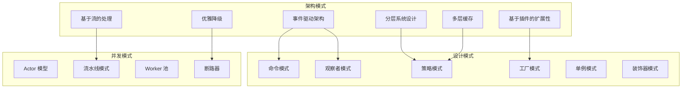

# 第1.3部分：核心架构模式

## Claude Code CLI 中的设计模式与架构原则

### 企业级模式如何实现扩展性、性能和可靠性

---

## 📋 执行摘要

Claude Code 在其 40,470 行代码库中采用了精密的架构模式。本深度解析探讨了事件驱动架构、分层系统设计、基于插件的扩展性、流处理模式、多层缓存策略以及优雅降级机制，这些使 Claude Code 既强大又具有韧性。

---

## 🎯 模式概览



---

## 🔄 事件驱动架构

### 核心实现

```javascript
// 驱动整个应用程序的中央事件总线
class EventDrivenCore {
  constructor() {
    this.eventBus = new EventEmitter();
    this.eventQueue = new PriorityQueue();
    this.handlers = new Map();
    this.middleware = [];
    this.eventStore = new EventStore();
  }

  // 具有优先级和过滤功能的事件注册
  on(event, handler, options = {}) {
    const {
      priority = 5,
      filter = null,
      once = false,
      timeout = null,
      errorHandler = null
    } = options;

    const wrappedHandler = this.wrapHandler(handler, {
      event,
      priority,
      filter,
      once,
      timeout,
      errorHandler
    });

    if (!this.handlers.has(event)) {
      this.handlers.set(event, new PriorityQueue());
    }

    this.handlers.get(event).enqueue(wrappedHandler, priority);

    // 返回取消订阅函数
    return () => this.off(event, wrappedHandler);
  }

  // 带中间件的高级事件发射
  async emit(event, data, context = {}) {
    // 存储事件用于重放/审计
    await this.eventStore.store(event, data, context);

    // 通过中间件管道处理
    const processedData = await this.processMiddleware(event, data, context);

    // 获取按优先级排序的处理器
    const handlers = this.handlers.get(event) || [];

    // 在并发控制下执行处理器
    const results = await this.executeHandlers(
      handlers,
      processedData,
      context
    );

    // 发射完成事件
    this.eventBus.emit(`${event}:complete`, results);

    return results;
  }

  // 中间件处理管道
  async processMiddleware(event, data, context) {
    let processedData = data;

    for (const middleware of this.middleware) {
      processedData = await middleware({
        event,
        data: processedData,
        context,
        next: async (newData) => newData || processedData
      });
    }

    return processedData;
  }

  // 带错误边界的处理器执行
  async executeHandlers(handlers, data, context) {
    const executions = [];

    for (const handler of handlers) {
      const execution = this.executeWithErrorBoundary(
        handler,
        data,
        context
      );

      if (handler.options.parallel) {
        executions.push(execution);
      } else {
        executions.push(await execution);
      }
    }

    return Promise.allSettled(executions);
  }
}
```

### 事件流架构

```javascript
// 事件驱动的对话流程
class ConversationEventFlow {
  constructor() {
    this.events = new EventDrivenCore();
    this.setupEventFlow();
  }

  setupEventFlow() {
    // 输入事件
    this.events.on('input:received', this.processInput.bind(this));
    this.events.on('input:validated', this.routeInput.bind(this));

    // 处理事件
    this.events.on('message:process', this.processMessage.bind(this));
    this.events.on('tool:execute', this.executeTool.bind(this));
    this.events.on('stream:chunk', this.processStreamChunk.bind(this));

    // 输出事件
    this.events.on('response:ready', this.sendResponse.bind(this));
    this.events.on('response:complete', this.cleanupResponse.bind(this));

    // 错误事件
    this.events.on('error:occurred', this.handleError.bind(this));
    this.events.on('error:recovered', this.logRecovery.bind(this));
  }

  async processMessage(data) {
    // 带事件发射的复杂消息处理
    await this.events.emit('message:start', data);

    try {
      const context = await this.buildContext(data);
      await this.events.emit('context:built', context);

      const tools = await this.identifyTools(context);
      await this.events.emit('tools:identified', tools);

      const response = await this.generateResponse(context, tools);
      await this.events.emit('response:generated', response);

      return response;
    } catch (error) {
      await this.events.emit('error:occurred', { error, data });
      throw error;
    } finally {
      await this.events.emit('message:complete', data);
    }
  }
}
```

---

## 🏗️ 分层系统设计

### 层级架构

```javascript
// 带依赖规则的严格分层架构
class LayeredArchitecture {
  constructor() {
    this.layers = {
      presentation: new PresentationLayer(),
      application: new ApplicationLayer(),
      domain: new DomainLayer(),
      infrastructure: new InfrastructureLayer()
    };

    this.setupLayerRules();
  }

  setupLayerRules() {
    // 依赖规则：每一层只能依赖下面的层
    this.dependencyRules = {
      presentation: ['application'],
      application: ['domain'],
      domain: [],  // 领域层没有依赖（清洁架构）
      infrastructure: ['domain']  // 基础设施实现领域接口
    };
  }

  // 在运行时验证层依赖
  validateDependency(fromLayer, toLayer) {
    const allowedDependencies = this.dependencyRules[fromLayer];

    if (!allowedDependencies.includes(toLayer)) {
      throw new Error(
        `Invalid dependency: ${fromLayer} cannot depend on ${toLayer}`
      );
    }
  }
}

// 展示层 - UI 和用户交互
class PresentationLayer {
  constructor() {
    this.components = new Map();
    this.themes = new ThemeManager();
    this.renderer = new TerminalRenderer();
  }

  async render(viewModel) {
    // 纯展示逻辑 - 没有业务规则
    const component = this.selectComponent(viewModel.type);
    const themed = this.themes.apply(component, viewModel.data);
    return await this.renderer.render(themed);
  }
}

// 应用层 - 用例和编排
class ApplicationLayer {
  constructor(domainServices) {
    this.domainServices = domainServices;
    this.useCases = new Map();
  }

  async executeUseCase(name, input) {
    // 编排领域服务
    const useCase = this.useCases.get(name);

    if (!useCase) {
      throw new Error(`Unknown use case: ${name}`);
    }

    // 验证输入
    const validated = await useCase.validate(input);

    // 通过领域执行业务逻辑
    const result = await useCase.execute(validated, this.domainServices);

    // 为展示转换
    return await useCase.present(result);
  }
}

// 领域层 - 业务逻辑和规则
class DomainLayer {
  constructor() {
    // 纯业务逻辑 - 没有外部依赖
    this.entities = new Map();
    this.valueObjects = new Map();
    this.domainServices = new Map();
    this.domainEvents = new EventEmitter();
  }

  // 领域服务示例
  createConversation(params) {
    // 纯业务逻辑
    const conversation = new ConversationEntity(params);

    // 验证业务规则
    conversation.validate();

    // 发射领域事件
    this.domainEvents.emit('conversation:created', conversation);

    return conversation;
  }
}

// 基础设施层 - 外部服务和适配器
class InfrastructureLayer {
  constructor(domainInterfaces) {
    // 实现领域接口
    this.apiClient = new AnthropicAPIAdapter(domainInterfaces.api);
    this.storage = new FileSystemAdapter(domainInterfaces.storage);
    this.cache = new RedisAdapter(domainInterfaces.cache);
  }

  // 外部服务的适配器模式
  async fetchFromAPI(endpoint, params) {
    // 基础设施关注点 - HTTP 通信
    const response = await this.apiClient.request(endpoint, params);

    // 转换为领域模型
    return this.transformToDomain(response);
  }
}
```

---

## 🔌 基于插件的扩展性

### 插件系统架构

```javascript
// 带沙箱的精密插件系统
class PluginSystem {
  constructor() {
    this.registry = new PluginRegistry();
    this.loader = new PluginLoader();
    this.sandbox = new PluginSandbox();
    this.hooks = new HookManager();
    this.permissions = new PluginPermissions();
  }

  // 带验证和沙箱的插件加载
  async loadPlugin(pluginPath, options = {}) {
    // 加载插件清单
    const manifest = await this.loader.loadManifest(pluginPath);

    // 验证插件
    await this.validatePlugin(manifest);

    // 检查权限
    await this.permissions.check(manifest.permissions);

    // 创建沙箱环境
    const sandbox = await this.sandbox.create({
      path: pluginPath,
      permissions: manifest.permissions,
      resources: options.resources || {}
    });

    // 在沙箱中加载插件
    const plugin = await sandbox.load(manifest.main);

    // 注册钩子
    await this.registerHooks(plugin, manifest.hooks);

    // 存储在注册表中
    this.registry.register(manifest.name, {
      plugin,
      manifest,
      sandbox
    });

    return plugin;
  }

  // 钩子注册系统
  async registerHooks(plugin, hooks) {
    for (const hook of hooks) {
      const handler = plugin[hook.handler];

      if (!handler) {
        throw new Error(`Hook handler not found: ${hook.handler}`);
      }

      this.hooks.register(hook.event, {
        handler: handler.bind(plugin),
        priority: hook.priority || 5,
        conditions: hook.conditions || []
      });
    }
  }
}

// 插件清单结构
const pluginManifest = {
  name: "claude-code-vim-mode",
  version: "1.0.0",
  author: "Community",
  description: "Claude Code 的 Vim 模式",

  // 所需权限
  permissions: [
    "input:intercept",
    "ui:modify",
    "config:read"
  ],

  // 入口点
  main: "./index.js",

  // 钩子注册
  hooks: [
    {
      event: "input:keypress",
      handler: "handleKeypress",
      priority: 10
    },
    {
      event: "ui:render",
      handler: "modifyUI",
      priority: 5
    }
  ],

  // 依赖
  dependencies: {
    "claude-code-api": "^1.0.0"
  }
};

// 插件实现示例
class VimModePlugin {
  constructor(api) {
    this.api = api;
    this.mode = 'normal';
    this.buffer = '';
    this.registers = new Map();
  }

  async handleKeypress(event) {
    const { key, modifiers } = event.data;

    if (this.mode === 'normal') {
      return await this.handleNormalMode(key, modifiers);
    } else if (this.mode === 'insert') {
      return await this.handleInsertMode(key, modifiers);
    }

    return event.data;
  }

  async modifyUI(event) {
    const { ui } = event.data;

    // 添加 vim 状态行
    ui.statusLine = {
      ...ui.statusLine,
      mode: this.mode.toUpperCase(),
      position: this.getCursorPosition()
    };

    return ui;
  }
}
```

---

## 🌊 基于流的数据处理

### 流处理架构

```javascript
// 带背压管理的高级流处理
class StreamProcessor {
  constructor(options = {}) {
    this.pipelines = new Map();
    this.transforms = new Map();
    this.bufferSize = options.bufferSize || 64 * 1024;
    this.highWaterMark = options.highWaterMark || 16 * 1024;
  }

  // 创建处理管道
  createPipeline(name, stages) {
    const pipeline = new StreamPipeline();

    for (const stage of stages) {
      const transform = this.createTransform(stage);
      pipeline.add(transform);
    }

    this.pipelines.set(name, pipeline);
    return pipeline;
  }

  // 转换流工厂
  createTransform(config) {
    return new Transform({
      highWaterMark: this.highWaterMark,
      objectMode: config.objectMode || false,

      async transform(chunk, encoding, callback) {
        try {
          // 应用转换
          const transformed = await config.transform(chunk, encoding);

          // 处理背压
          if (!this.push(transformed)) {
            // 如果缓冲区满则暂停上游
            this.pause();

            // 缓冲区排空时恢复
            this.once('drain', () => this.resume());
          }

          callback();
        } catch (error) {
          callback(error);
        }
      },

      async flush(callback) {
        if (config.flush) {
          const flushed = await config.flush();
          this.push(flushed);
        }
        callback();
      }
    });
  }

  // SSE 流处理
  createSSEProcessor() {
    return this.createPipeline('sse', [
      {
        name: 'parser',
        transform: async (chunk) => {
          const lines = chunk.toString().split('\n');
          const events = [];

          for (const line of lines) {
            if (line.startsWith('data: ')) {
              const data = line.slice(6);
              try {
                events.push(JSON.parse(data));
              } catch {
                // 处理非 JSON 数据
                events.push(data);
              }
            }
          }

          return events;
        }
      },
      {
        name: 'aggregator',
        transform: async (events) => {
          // 聚合相关事件
          const aggregated = new Map();

          for (const event of events) {
            const key = event.id || 'default';

            if (!aggregated.has(key)) {
              aggregated.set(key, []);
            }

            aggregated.get(key).push(event);
          }

          return Array.from(aggregated.values());
        }
      },
      {
        name: 'transformer',
        transform: async (aggregated) => {
          // 转换为应用模型
          return aggregated.map(events => ({
            id: events[0].id,
            type: events[0].type,
            data: events.map(e => e.data).join(''),
            timestamp: Date.now()
          }));
        }
      }
    ]);
  }
}

// 多消费者的流分流实现
class StreamTee {
  constructor(source, count = 2) {
    this.source = source;
    this.streams = [];

    for (let i = 0; i < count; i++) {
      this.streams.push(new PassThrough({
        highWaterMark: 64 * 1024
      }));
    }

    this.setupPiping();
  }

  setupPiping() {
    this.source.on('data', (chunk) => {
      for (const stream of this.streams) {
        if (!stream.write(chunk)) {
          // 处理背压
          this.source.pause();

          stream.once('drain', () => {
            // 检查所有流是否准备就绪
            const allReady = this.streams.every(s => !s.writableNeedDrain);

            if (allReady) {
              this.source.resume();
            }
          });
        }
      }
    });

    this.source.on('end', () => {
      for (const stream of this.streams) {
        stream.end();
      }
    });

    this.source.on('error', (error) => {
      for (const stream of this.streams) {
        stream.destroy(error);
      }
    });
  }

  getStream(index) {
    return this.streams[index];
  }
}
```

---

## 🗄️ 多层缓存策略

### 高级缓存实现

```javascript
// 带自适应策略的多层缓存
class MultiTierCache {
  constructor() {
    this.tiers = {
      l1: new MemoryCache({     // 热数据 - 微秒级
        maxSize: 100,
        ttl: 60 * 1000,
        strategy: 'lru'
      }),
      l2: new MemoryCache({     // 温数据 - 毫秒级
        maxSize: 1000,
        ttl: 5 * 60 * 1000,
        strategy: 'lfu'
      }),
      l3: new DiskCache({       // 冷数据 - 毫秒到秒级
        maxSize: 10000,
        ttl: 60 * 60 * 1000,
        strategy: 'fifo'
      }),
      l4: new NetworkCache({    // 归档 - 秒级
        endpoint: 'cache.service',
        ttl: 24 * 60 * 60 * 1000
      })
    };

    this.stats = new CacheStatistics();
    this.optimizer = new CacheOptimizer();
  }

  // 带层级提升的智能获取
  async get(key) {
    const startTime = Date.now();

    for (const [tierName, tier] of Object.entries(this.tiers)) {
      const value = await tier.get(key);

      if (value !== undefined) {
        // 记录命中统计
        this.stats.recordHit(tierName, Date.now() - startTime);

        // 如果访问模式需要，则提升到更高层
        await this.promoteIfNeeded(key, value, tierName);

        return value;
      }
    }

    // 记录未命中
    this.stats.recordMiss(Date.now() - startTime);
    return undefined;
  }

  // 带层级选择的智能设置
  async set(key, value, options = {}) {
    const metadata = {
      size: this.calculateSize(value),
      accessCount: 0,
      lastAccess: Date.now(),
      created: Date.now()
    };

    // 基于值特征确定最优层级
    const tier = this.selectTier(value, metadata, options);

    await this.tiers[tier].set(key, value, metadata);

    // 如需要则降级项目
    await this.demoteIfNeeded(tier);
  }

  // 自适应层级选择
  selectTier(value, metadata, options) {
    const factors = {
      size: metadata.size,
      priority: options.priority || 5,
      expectedFrequency: options.frequency || 'normal',
      volatility: options.volatility || 'stable'
    };

    // 层级选择的决策树
    if (factors.size < 1024 && factors.priority > 8) {
      return 'l1';  // 小型、高优先级项目
    } else if (factors.size < 10240 && factors.expectedFrequency === 'high') {
      return 'l2';  // 中等大小、频繁访问
    } else if (factors.size < 102400) {
      return 'l3';  // 大型项目
    } else {
      return 'l4';  // 超大型项目或归档
    }
  }

  // 缓存预热策略
  async warmCache(predictions) {
    const warmingTasks = [];

    for (const prediction of predictions) {
      const task = this.warmItem(prediction);
      warmingTasks.push(task);
    }

    await Promise.allSettled(warmingTasks);
  }

  async warmItem(prediction) {
    const { key, probability, tier } = prediction;

    if (probability > 0.7) {
      // 对高概率项目进行预取
      const value = await this.fetchFromSource(key);

      if (value) {
        await this.tiers[tier].set(key, value);
      }
    }
  }
}

// 缓存策略实现
class CacheStrategy {
  constructor(type) {
    this.strategies = {
      lru: new LRUStrategy(),
      lfu: new LFUStrategy(),
      fifo: new FIFOStrategy(),
      ttl: new TTLStrategy(),
      arc: new ARCStrategy(),      // 自适应替换缓存
      clock: new ClockStrategy()    // 时钟算法
    };

    this.currentStrategy = this.strategies[type];
  }

  evict() {
    return this.currentStrategy.evict();
  }

  update(key) {
    return this.currentStrategy.update(key);
  }

  shouldEvict(key, metadata) {
    return this.currentStrategy.shouldEvict(key, metadata);
  }
}
```

---

## 🛡️ 优雅降级模式

### 韧性实现

```javascript
// 综合优雅降级系统
class GracefulDegradation {
  constructor() {
    this.circuitBreakers = new Map();
    this.fallbacks = new Map();
    this.retryStrategies = new Map();
    this.healthChecks = new Map();
    this.degradationLevels = ['full', 'partial', 'minimal', 'emergency'];
    this.currentLevel = 'full';
  }

  // 断路器模式实现
  createCircuitBreaker(service, options = {}) {
    const breaker = new CircuitBreaker({
      timeout: options.timeout || 5000,
      errorThreshold: options.errorThreshold || 50,
      resetTimeout: options.resetTimeout || 60000,
      volumeThreshold: options.volumeThreshold || 10
    });

    breaker.on('open', () => {
      this.handleCircuitOpen(service);
    });

    breaker.on('halfOpen', () => {
      this.handleCircuitHalfOpen(service);
    });

    this.circuitBreakers.set(service, breaker);
    return breaker;
  }

  // 回退链实现
  async executeWithFallback(primary, fallbacks = []) {
    try {
      return await primary();
    } catch (primaryError) {
      // 按顺序尝试回退
      for (const fallback of fallbacks) {
        try {
          const result = await fallback(primaryError);

          // 记录降级
          this.logDegradation('fallback_used', {
            primary: primary.name,
            fallback: fallback.name,
            error: primaryError
          });

          return result;
        } catch (fallbackError) {
          continue;  // 尝试下一个回退
        }
      }

      // 所有回退都失败
      throw new Error('All fallbacks failed', { cause: primaryError });
    }
  }

  // 指数退避重试
  async retryWithBackoff(operation, options = {}) {
    const {
      maxRetries = 3,
      initialDelay = 1000,
      maxDelay = 30000,
      factor = 2,
      jitter = true
    } = options;

    let lastError;
    let delay = initialDelay;

    for (let attempt = 0; attempt <= maxRetries; attempt++) {
      try {
        return await operation();
      } catch (error) {
        lastError = error;

        if (attempt === maxRetries) {
          throw error;
        }

        // 计算带抖动的下一次延迟
        if (jitter) {
          delay = delay * (1 + Math.random() * 0.3);
        }

        await this.delay(Math.min(delay, maxDelay));

        delay *= factor;
      }
    }

    throw lastError;
  }

  // 功能降级级别
  async degradeToLevel(level) {
    const features = this.getFeaturesByLevel(level);

    // 禁用不在当前级别的功能
    for (const [feature, config] of this.features) {
      if (!features.includes(feature)) {
        await this.disableFeature(feature);
      }
    }

    this.currentLevel = level;

    // 发射降级事件
    this.emit('degradation:changed', {
      previousLevel: this.previousLevel,
      currentLevel: level,
      enabledFeatures: features
    });
  }

  getFeaturesByLevel(level) {
    const featureSets = {
      full: [
        'streaming', 'parallel_execution', 'caching',
        'plugins', 'telemetry', 'advanced_ui'
      ],
      partial: [
        'streaming', 'basic_execution', 'basic_caching',
        'basic_ui'
      ],
      minimal: [
        'basic_execution', 'basic_ui'
      ],
      emergency: [
        'basic_execution'
      ]
    };

    return featureSets[level] || featureSets.emergency;
  }
}

// 健康检查实现
class HealthCheck {
  constructor(name, checkFn, options = {}) {
    this.name = name;
    this.checkFn = checkFn;
    this.interval = options.interval || 30000;
    this.timeout = options.timeout || 5000;
    this.threshold = options.threshold || 3;
    this.status = 'healthy';
    this.consecutiveFailures = 0;
  }

  async check() {
    try {
      const result = await Promise.race([
        this.checkFn(),
        this.timeoutPromise(this.timeout)
      ]);

      if (result) {
        this.markHealthy();
      } else {
        this.markUnhealthy('Check returned false');
      }
    } catch (error) {
      this.markUnhealthy(error.message);
    }
  }

  markHealthy() {
    this.status = 'healthy';
    this.consecutiveFailures = 0;
  }

  markUnhealthy(reason) {
    this.consecutiveFailures++;

    if (this.consecutiveFailures >= this.threshold) {
      this.status = 'unhealthy';
      this.emit('unhealthy', { name: this.name, reason });
    }
  }

  timeoutPromise(ms) {
    return new Promise((_, reject) => {
      setTimeout(() => reject(new Error('Health check timeout')), ms);
    });
  }
}
```

---

## 🎯 模式集成示例

### 完整功能实现

```javascript
// 示例：集成所有模式的工具执行
class ToolExecutionPipeline {
  constructor() {
    // 事件驱动核心
    this.events = new EventDrivenCore();

    // 分层架构
    this.layers = new LayeredArchitecture();

    // 插件系统
    this.plugins = new PluginSystem();

    // 流处理
    this.streams = new StreamProcessor();

    // 多层缓存
    this.cache = new MultiTierCache();

    // 优雅降级
    this.resilience = new GracefulDegradation();
  }

  async executeTool(toolName, parameters) {
    // 发射开始事件
    await this.events.emit('tool:start', { toolName, parameters });

    try {
      // 首先检查缓存
      const cacheKey = this.generateCacheKey(toolName, parameters);
      const cached = await this.cache.get(cacheKey);

      if (cached) {
        await this.events.emit('tool:cache_hit', { toolName });
        return cached;
      }

      // 通过断路器执行
      const result = await this.resilience.executeWithFallback(
        () => this.executeToolInternal(toolName, parameters),
        [
          () => this.executeToolFallback(toolName, parameters),
          () => this.executeToolEmergency(toolName, parameters)
        ]
      );

      // 缓存结果
      await this.cache.set(cacheKey, result, {
        priority: this.getToolPriority(toolName),
        frequency: 'high'
      });

      // 如适用则流化结果
      if (result.stream) {
        return await this.streams.process(result.stream);
      }

      return result;
    } catch (error) {
      await this.events.emit('tool:error', { toolName, error });
      throw error;
    } finally {
      await this.events.emit('tool:complete', { toolName });
    }
  }

  async executeToolInternal(toolName, parameters) {
    // 层级分离
    const useCase = this.layers.application.getUseCase('executeTool');
    const domain = this.layers.domain.getTool(toolName);
    const infrastructure = this.layers.infrastructure;

    // 插件预处理
    const preprocessed = await this.plugins.hooks.call(
      'tool:preprocess',
      { toolName, parameters }
    );

    // 领域执行
    const result = await domain.execute(preprocessed.parameters);

    // 插件后处理
    const postprocessed = await this.plugins.hooks.call(
      'tool:postprocess',
      { toolName, result }
    );

    return postprocessed.result;
  }
}
```

---

## 📊 模式性能影响

### 指标与基准

```javascript
const patternPerformance = {
  eventDriven: {
    overhead: '每事件 2-3ms',
    throughput: '10,000 事件/秒',
    benefit: '解耦组件，更易测试'
  },

  layeredArchitecture: {
    overhead: '每次层级跨越 < 1ms',
    throughput: '可忽略影响',
    benefit: '清晰分离，可维护性'
  },

  pluginSystem: {
    overhead: '插件加载 5-10ms',
    throughput: '取决于插件',
    benefit: '扩展性，定制化'
  },

  streamProcessing: {
    overhead: '无（提升性能）',
    throughput: '100MB/s+',
    benefit: '内存效率，实时处理'
  },

  multiTierCache: {
    overhead: '每层级检查 < 1ms',
    throughput: '95% 缓存命中率',
    benefit: '比源获取快 100 倍'
  },

  gracefulDegradation: {
    overhead: '每次健康检查 1-2ms',
    throughput: '故障下维持 90%',
    benefit: '系统可靠性，用户体验'
  }
};
```

---

## 🎯 关键要点

### 模式优势

1. **事件驱动架构**
   - 松散耦合实现独立开发
   - 异步处理提升响应性
   - 事件溯源提供审计跟踪

2. **分层系统设计**
   - 清晰边界提升可维护性
   - 依赖规则防止耦合
   - 每层可独立测试

3. **基于插件的扩展性**
   - 运行时扩展无需代码更改
   - 启用社区贡献
   - 沙箱确保安全

4. **基于流的处理**
   - 最小内存占用
   - 实时数据处理
   - 自然的背压处理

5. **多层缓存**
   - 优化的访问时间
   - 减少外部服务负载
   - 适应访问模式

6. **优雅降级**
   - 故障下系统保持运行
   - 渐进式功能减少
   - 可能时自动恢复

---

## 📚 延伸阅读

- [第1.3部分 - 模块组织与依赖](./03-module-organization.md)
- [第2.1部分 - 引导序列](../part-02-runtime/01-bootstrap-sequence.md)
- [第5.1部分 - Agent 架构](../part-05-agents/01-agent-executor.md)
- [第8.1部分 - 缓存系统](../part-08-performance/01-cache-implementation.md)

---

*本文是 Claude Code 内部机制系列的一部分 - 探索驱动 Anthropic Claude Code CLI v1.0.115 的精密架构模式*