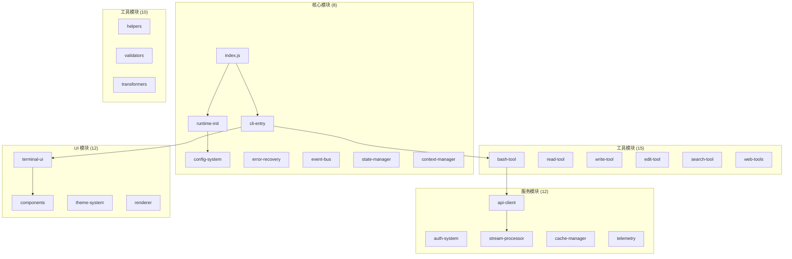

# 第1.4部分：模块组织与依赖

## 71个模块如何创建一个统一的系统架构

### Claude Code 中的依赖管理、模块边界和动态加载

---

## 📋 执行摘要

Claude Code 的 40,470 行代码被精心组织成 71 个具有精心管理依赖关系的模块。本深度解析探讨了模块依赖图、核心模块与外围模块的区别、循环依赖解决策略、动态模块加载机制，以及创建可维护和高性能系统的包优化技术。

---

## 🗺️ 模块拓扑概览



---

## 📊 模块依赖分析

### 依赖图可视化

```javascript
// 模块依赖分析器
class DependencyAnalyzer {
  constructor() {
    this.modules = new Map();
    this.dependencies = new Map();
    this.inverseDependencies = new Map();
    this.circularDependencies = new Set();
  }

  // 分析模块依赖
  async analyzeModule(modulePath) {
    const module = await this.loadModule(modulePath);
    const ast = await this.parseToAST(module);

    const dependencies = {
      imports: this.extractImports(ast),
      requires: this.extractRequires(ast),
      dynamic: this.extractDynamicImports(ast),
      injected: this.extractInjectedDependencies(ast)
    };

    this.modules.set(modulePath, {
      path: modulePath,
      dependencies,
      exports: this.extractExports(ast),
      metrics: this.calculateMetrics(ast)
    });

    return dependencies;
  }

  // 构建完整依赖图
  buildDependencyGraph() {
    const graph = {
      nodes: [],
      edges: [],
      clusters: new Map()
    };

    // 创建节点
    for (const [path, module] of this.modules) {
      graph.nodes.push({
        id: path,
        label: this.getModuleName(path),
        type: this.getModuleType(module),
        metrics: module.metrics
      });
    }

    // 创建边
    for (const [path, module] of this.modules) {
      for (const dep of this.getAllDependencies(module)) {
        graph.edges.push({
          source: path,
          target: dep,
          type: this.getDependencyType(module, dep)
        });
      }
    }

    // 检测集群
    graph.clusters = this.detectClusters(graph);

    return graph;
  }

  // 检测循环依赖
  detectCircularDependencies() {
    const visited = new Set();
    const recursionStack = new Set();
    const cycles = [];

    const dfs = (node, path = []) => {
      visited.add(node);
      recursionStack.add(node);
      path.push(node);

      const deps = this.dependencies.get(node) || [];

      for (const dep of deps) {
        if (!visited.has(dep)) {
          dfs(dep, [...path]);
        } else if (recursionStack.has(dep)) {
          // 发现循环依赖
          const cycleStart = path.indexOf(dep);
          const cycle = path.slice(cycleStart);
          cycles.push(cycle);
        }
      }

      recursionStack.delete(node);
    };

    // 从每个未访问节点运行 DFS
    for (const node of this.modules.keys()) {
      if (!visited.has(node)) {
        dfs(node);
      }
    }

    return cycles;
  }

  // 计算模块内聚性和耦合性
  calculateCohesionCoupling() {
    const metrics = new Map();

    for (const [path, module] of this.modules) {
      const internalCalls = this.countInternalCalls(module);
      const externalCalls = this.countExternalCalls(module);

      metrics.set(path, {
        cohesion: internalCalls / (internalCalls + externalCalls),
        coupling: this.dependencies.get(path)?.length || 0,
        afferentCoupling: this.inverseDependencies.get(path)?.length || 0,
        instability: this.calculateInstability(path)
      });
    }

    return metrics;
  }

  calculateInstability(modulePath) {
    const efferent = this.dependencies.get(modulePath)?.length || 0;
    const afferent = this.inverseDependencies.get(modulePath)?.length || 0;

    if (efferent + afferent === 0) return 0;

    return efferent / (efferent + afferent);
  }
}
```

### 模块类别与职责

```javascript
// 模块组织结构
const moduleStructure = {
  // 核心模块 - 系统运行必需
  core: {
    'src/index.js': {
      responsibility: '主入口点和导出',
      dependencies: ['runtime', 'cli', 'api'],
      criticalPath: true
    },
    'src/runtime/runtime-initialization.js': {
      responsibility: '引导和环境设置',
      dependencies: ['config', 'logging', 'error-handling'],
      criticalPath: true
    },
    'src/cli/cli-entry.js': {
      responsibility: '命令行界面入口',
      dependencies: ['commander', 'conversation', 'tools'],
      criticalPath: true
    }
  },

  // 工具模块 - 面向用户的功能
  tools: {
    'src/tools/bash-tool.js': {
      responsibility: 'Shell 命令执行',
      dependencies: ['child_process', 'permissions', 'sandbox'],
      security: 'high'
    },
    'src/tools/read-tool.js': {
      responsibility: '文件读取操作',
      dependencies: ['fs', 'path', 'mime-types'],
      security: 'medium'
    },
    'src/tools/edit-tool.js': {
      responsibility: '文件编辑操作',
      dependencies: ['fs', 'diff', 'backup'],
      security: 'high'
    }
  },

  // 服务模块 - 外部集成
  services: {
    'src/api/anthropic-client.js': {
      responsibility: 'Anthropic API 通信',
      dependencies: ['http', 'streaming', 'auth'],
      external: true
    },
    'src/auth/oauth-flow.js': {
      responsibility: 'OAuth 2.0 身份验证',
      dependencies: ['crypto', 'http', 'storage'],
      security: 'critical'
    }
  },

  // UI 模块 - 用户界面
  ui: {
    'src/ui/terminal-ui.js': {
      responsibility: '终端界面渲染',
      dependencies: ['ink', 'react', 'components'],
      async: true
    },
    'src/ui/components/spinner.js': {
      responsibility: '加载指示器',
      dependencies: ['ink', 'react'],
      reusable: true
    }
  },

  // 工具模块 - 共享功能
  utilities: {
    'src/utils/stream-processing.js': {
      responsibility: '流转换实用工具',
      dependencies: ['stream', 'buffer'],
      performance: 'critical'
    },
    'src/utils/validation.js': {
      responsibility: '输入验证',
      dependencies: [],
      pure: true
    }
  }
};
```

---

## 🔄 循环依赖解决

### 检测与解决策略

```javascript
// 循环依赖解决器
class CircularDependencyResolver {
  constructor() {
    this.resolutionStrategies = new Map([
      ['dependency-injection', this.resolveDI.bind(this)],
      ['lazy-loading', this.resolveLazy.bind(this)],
      ['event-based', this.resolveEvents.bind(this)],
      ['interface-abstraction', this.resolveInterface.bind(this)]
    ]);
  }

  // 策略1：依赖注入
  resolveDI(moduleA, moduleB) {
    // 不是直接导入，而是注入依赖
    return {
      moduleA: `
        class ModuleA {
          constructor(moduleB = null) {
            this.moduleB = moduleB;
          }

          setModuleB(moduleB) {
            this.moduleB = moduleB;
          }

          useModuleB() {
            if (!this.moduleB) {
              throw new Error('ModuleB not injected');
            }
            return this.moduleB.someMethod();
          }
        }

        module.exports = ModuleA;
      `,

      moduleB: `
        class ModuleB {
          constructor(moduleA = null) {
            this.moduleA = moduleA;
          }

          setModuleA(moduleA) {
            this.moduleA = moduleA;
          }

          useModuleA() {
            if (!this.moduleA) {
              throw new Error('ModuleA not injected');
            }
            return this.moduleA.someMethod();
          }
        }

        module.exports = ModuleB;
      `,

      setup: `
        const ModuleA = require('./moduleA');
        const ModuleB = require('./moduleB');

        const moduleA = new ModuleA();
        const moduleB = new ModuleB();

        moduleA.setModuleB(moduleB);
        moduleB.setModuleA(moduleA);

        module.exports = { moduleA, moduleB };
      `
    };
  }

  // 策略2：延迟加载
  resolveLazy(moduleA, moduleB) {
    return {
      moduleA: `
        class ModuleA {
          get moduleB() {
            if (!this._moduleB) {
              // 首次使用时延迟加载
              this._moduleB = require('./moduleB');
            }
            return this._moduleB;
          }

          useModuleB() {
            return this.moduleB.someMethod();
          }
        }

        module.exports = ModuleA;
      `
    };
  }

  // 策略3：基于事件的通信
  resolveEvents(moduleA, moduleB) {
    return {
      eventBus: `
        const EventEmitter = require('events');

        class EventBus extends EventEmitter {
          constructor() {
            super();
            this.setMaxListeners(100);
          }
        }

        module.exports = new EventBus();
      `,

      moduleA: `
        const eventBus = require('./eventBus');

        class ModuleA {
          constructor() {
            eventBus.on('moduleB:event', this.handleModuleBEvent.bind(this));
          }

          emitToB(data) {
            eventBus.emit('moduleA:event', data);
          }

          handleModuleBEvent(data) {
            // 处理来自 ModuleB 的事件
          }
        }

        module.exports = ModuleA;
      `
    };
  }

  // 策略4：接口抽象
  resolveInterface(moduleA, moduleB) {
    return {
      interface: `
        // 定义共享接口
        class SharedInterface {
          methodA() { throw new Error('Not implemented'); }
          methodB() { throw new Error('Not implemented'); }
        }

        module.exports = SharedInterface;
      `,

      moduleA: `
        const SharedInterface = require('./interface');

        class ModuleA extends SharedInterface {
          methodA() {
            // 实现
          }
        }

        module.exports = ModuleA;
      `
    };
  }

  // 自动解决方案选择
  selectResolutionStrategy(cycle) {
    const modules = cycle.map(path => this.analyzeModule(path));

    // 策略选择启发式
    if (modules.every(m => m.type === 'service')) {
      return 'dependency-injection';
    }

    if (modules.some(m => m.size > 10000)) {
      return 'lazy-loading';
    }

    if (modules.every(m => m.async)) {
      return 'event-based';
    }

    return 'interface-abstraction';
  }
}
```

---

## 🔌 动态模块加载

### 运行时模块系统

```javascript
// 带缓存和验证的动态模块加载器
class DynamicModuleLoader {
  constructor() {
    this.cache = new Map();
    this.loaders = new Map();
    this.validators = new Map();
    this.transformers = [];
    this.sandbox = new ModuleSandbox();
  }

  // 为文件类型注册自定义加载器
  registerLoader(extension, loader) {
    this.loaders.set(extension, loader);
  }

  // 带验证的动态导入
  async import(modulePath, options = {}) {
    const {
      cache = true,
      validate = true,
      transform = true,
      sandbox = false
    } = options;

    // 检查缓存
    if (cache && this.cache.has(modulePath)) {
      return this.cache.get(modulePath);
    }

    try {
      // 加载模块
      let module = await this.loadModule(modulePath);

      // 应用转换
      if (transform) {
        module = await this.transformModule(module, modulePath);
      }

      // 验证模块
      if (validate) {
        await this.validateModule(module, modulePath);
      }

      // 如需要则沙箱化
      if (sandbox) {
        module = await this.sandboxModule(module, modulePath);
      }

      // 缓存模块
      if (cache) {
        this.cache.set(modulePath, module);
      }

      return module;
    } catch (error) {
      throw new Error(`Failed to load module ${modulePath}: ${error.message}`);
    }
  }

  // 基于类型加载模块
  async loadModule(modulePath) {
    const extension = path.extname(modulePath);
    const loader = this.loaders.get(extension) || this.defaultLoader;

    return await loader(modulePath);
  }

  // 默认 CommonJS/ESM 加载器
  async defaultLoader(modulePath) {
    // 首先尝试 ESM
    try {
      return await import(modulePath);
    } catch (esmError) {
      // 回退到 CommonJS
      try {
        return require(modulePath);
      } catch (cjsError) {
        throw new Error(`Module format not supported: ${modulePath}`);
      }
    }
  }

  // 转换模块（例如，TypeScript、JSX）
  async transformModule(module, modulePath) {
    let transformed = module;

    for (const transformer of this.transformers) {
      if (transformer.canTransform(modulePath)) {
        transformed = await transformer.transform(transformed, modulePath);
      }
    }

    return transformed;
  }

  // 验证模块结构
  async validateModule(module, modulePath) {
    const validator = this.validators.get(path.dirname(modulePath));

    if (validator) {
      const isValid = await validator.validate(module);

      if (!isValid) {
        throw new Error(`Module validation failed: ${modulePath}`);
      }
    }

    // 基本验证
    if (!module || typeof module !== 'object') {
      throw new Error(`Invalid module structure: ${modulePath}`);
    }
  }

  // 沙箱模块执行
  async sandboxModule(module, modulePath) {
    return await this.sandbox.execute(module, {
      permissions: this.getModulePermissions(modulePath),
      timeout: 5000,
      memory: 50 * 1024 * 1024  // 50MB
    });
  }

  // 热模块替换
  async hotReload(modulePath) {
    // 使缓存失效
    this.cache.delete(modulePath);
    this.invalidateDependents(modulePath);

    // 重新加载模块
    const newModule = await this.import(modulePath, { cache: false });

    // 更新引用
    await this.updateReferences(modulePath, newModule);

    // 发射重载事件
    this.emit('module:reloaded', { path: modulePath, module: newModule });

    return newModule;
  }

  // 使依赖模块失效
  invalidateDependents(modulePath) {
    const dependents = this.findDependents(modulePath);

    for (const dependent of dependents) {
      this.cache.delete(dependent);

      // 递归使失效
      this.invalidateDependents(dependent);
    }
  }
}

// 用于安全执行的模块沙箱
class ModuleSandbox {
  constructor() {
    this.vm = require('vm');
    this.contexts = new Map();
  }

  async execute(module, options) {
    const context = this.createContext(options.permissions);

    const script = new this.vm.Script(`
      (function(exports, require, module, __filename, __dirname) {
        ${module.toString()}
      })
    `);

    const sandbox = {
      exports: {},
      require: this.createSafeRequire(options.permissions),
      module: { exports: {} },
      __filename: 'sandbox.js',
      __dirname: '/sandbox',
      console: this.createSafeConsole(),
      setTimeout: this.createSafeTimer(options.timeout),
      setInterval: this.createSafeTimer(options.timeout),
      process: this.createSafeProcess(options.permissions)
    };

    const result = script.runInNewContext(sandbox, {
      timeout: options.timeout,
      memoryLimit: options.memory
    });

    return sandbox.module.exports || sandbox.exports;
  }

  createSafeRequire(permissions) {
    return (moduleName) => {
      if (!permissions.includes(`require:${moduleName}`)) {
        throw new Error(`Module not allowed: ${moduleName}`);
      }

      // 允许模块的白名单
      const allowed = ['path', 'url', 'querystring', 'util'];

      if (allowed.includes(moduleName)) {
        return require(moduleName);
      }

      throw new Error(`Module not in whitelist: ${moduleName}`);
    };
  }
}
```

---

## 📦 包优化策略

### 代码分割与摇树优化

```javascript
// 生产构建的包优化器
class BundleOptimizer {
  constructor() {
    this.chunks = new Map();
    this.entryPoints = new Set();
    this.commonChunks = new Map();
  }

  // 分析和优化包
  async optimize(modules, config) {
    // 步骤1：分析模块图
    const graph = await this.analyzeModuleGraph(modules);

    // 步骤2：识别代码分割点
    const splitPoints = this.identifySplitPoints(graph, config);

    // 步骤3：创建块
    const chunks = await this.createChunks(graph, splitPoints);

    // 步骤4：提取通用块
    const optimizedChunks = this.extractCommonChunks(chunks);

    // 步骤5：摇树优化未使用的导出
    const shakenChunks = await this.treeShake(optimizedChunks);

    // 步骤6：压缩和压缩
    const finalChunks = await this.minifyChunks(shakenChunks);

    return finalChunks;
  }

  // 识别最优分割点
  identifySplitPoints(graph, config) {
    const splitPoints = new Set();

    // 策略1：基于路由的分割
    for (const route of config.routes || []) {
      const routeModules = this.findRouteModules(graph, route);
      splitPoints.add({
        type: 'route',
        name: route.name,
        modules: routeModules
      });
    }

    // 策略2：动态导入分割
    for (const module of graph.modules) {
      const dynamicImports = module.dynamicImports || [];

      for (const dynamicImport of dynamicImports) {
        splitPoints.add({
          type: 'dynamic',
          name: `dynamic-${dynamicImport}`,
          modules: [dynamicImport]
        });
      }
    }

    // 策略3：供应商分割
    const vendorModules = graph.modules.filter(m =>
      m.path.includes('node_modules')
    );

    splitPoints.add({
      type: 'vendor',
      name: 'vendor',
      modules: vendorModules.map(m => m.path)
    });

    // 策略4：通用块
    const commonModules = this.identifyCommonModules(graph, config);

    splitPoints.add({
      type: 'common',
      name: 'common',
      modules: commonModules
    });

    return splitPoints;
  }

  // 创建优化块
  createChunks(graph, splitPoints) {
    const chunks = new Map();

    for (const splitPoint of splitPoints) {
      const chunk = {
        name: splitPoint.name,
        type: splitPoint.type,
        modules: new Set(),
        dependencies: new Set(),
        size: 0
      };

      // 将模块添加到块
      for (const modulePath of splitPoint.modules) {
        const module = graph.getModule(modulePath);

        if (module) {
          chunk.modules.add(module);
          chunk.size += module.size;

          // 跟踪依赖
          for (const dep of module.dependencies) {
            if (!splitPoint.modules.includes(dep)) {
              chunk.dependencies.add(dep);
            }
          }
        }
      }

      chunks.set(chunk.name, chunk);
    }

    return chunks;
  }

  // 将通用模块提取到共享块中
  extractCommonChunks(chunks) {
    const moduleUsage = new Map();

    // 计算跨块的模块使用情况
    for (const chunk of chunks.values()) {
      for (const module of chunk.modules) {
        const usage = moduleUsage.get(module.path) || new Set();
        usage.add(chunk.name);
        moduleUsage.set(module.path, usage);
      }
    }

    // 提取在多个块中使用的模块
    const commonChunk = {
      name: 'common',
      type: 'common',
      modules: new Set(),
      size: 0
    };

    for (const [modulePath, usage] of moduleUsage) {
      if (usage.size >= 2) {  // 在2+块中使用
        const module = this.findModule(chunks, modulePath);

        if (module) {
          commonChunk.modules.add(module);
          commonChunk.size += module.size;

          // 从原始块中移除
          for (const chunkName of usage) {
            const chunk = chunks.get(chunkName);
            chunk.modules.delete(module);
            chunk.size -= module.size;
          }
        }
      }
    }

    if (commonChunk.modules.size > 0) {
      chunks.set('common', commonChunk);
    }

    return chunks;
  }

  // 摇树优化 - 移除未使用的导出
  async treeShake(chunks) {
    const usedExports = new Set();

    // 标记所有使用的导出
    for (const chunk of chunks.values()) {
      for (const module of chunk.modules) {
        const imports = await this.analyzeImports(module);

        for (const imp of imports) {
          usedExports.add(`${imp.module}:${imp.export}`);
        }
      }
    }

    // 移除未使用的导出
    for (const chunk of chunks.values()) {
      for (const module of chunk.modules) {
        const exports = await this.analyzeExports(module);

        for (const exp of exports) {
          const exportId = `${module.path}:${exp.name}`;

          if (!usedExports.has(exportId) && !exp.sideEffects) {
            // 移除未使用的导出
            module.code = this.removeExport(module.code, exp);
            module.size = Buffer.byteLength(module.code);
          }
        }
      }
    }

    return chunks;
  }

  // 压缩策略
  async minifyChunks(chunks) {
    const minified = new Map();

    for (const [name, chunk] of chunks) {
      const minifiedChunk = {
        ...chunk,
        code: await this.minifyCode(chunk),
        sourceMap: await this.generateSourceMap(chunk)
      };

      // 应用额外的优化
      minifiedChunk.code = await this.applyOptimizations(minifiedChunk.code, {
        removeConsole: true,
        removeDebugger: true,
        inlineConstants: true,
        simplifyConditionals: true
      });

      minified.set(name, minifiedChunk);
    }

    return minified;
  }
}
```

---

## 🎯 模块加载策略

### 渐进式加载实现

```javascript
// 渐进式模块加载系统
class ProgressiveLoader {
  constructor() {
    this.priorities = new Map();
    this.loaded = new Set();
    this.loading = new Map();
    this.queue = new PriorityQueue();
  }

  // 定义加载策略
  defineStrategy(config) {
    return {
      // 关键模块 - 立即加载
      critical: [
        'src/index.js',
        'src/runtime/runtime-initialization.js',
        'src/cli/cli-entry.js'
      ],

      // 核心模块 - 关键模块之后加载
      core: [
        'src/conversation/conversation-loop.js',
        'src/api/anthropic-client.js',
        'src/config/configuration-system.js'
      ],

      // 功能模块 - 按需加载
      features: {
        'tools': [
          'src/tools/bash-tool.js',
          'src/tools/read-tool.js',
          'src/tools/write-tool.js'
        ],
        'ui': [
          'src/ui/terminal-ui.js',
          'src/ui/components/*.js'
        ],
        'plugins': [
          'src/plugins/plugin-system.js',
          'src/hooks/hook-system.js'
        ]
      },

      // 延迟模块 - 需要时加载
      lazy: [
        'src/telemetry/*.js',
        'src/analytics/*.js',
        'src/development/*.js'
      ]
    };
  }

  // 渐进式加载实现
  async load(strategy) {
    // 阶段1：关键模块（阻塞）
    await this.loadCritical(strategy.critical);

    // 阶段2：核心模块（并行）
    this.loadCore(strategy.core);  // 非阻塞

    // 阶段3：功能模块（按需）
    this.setupFeatureLoading(strategy.features);

    // 阶段4：延迟模块（后台）
    this.scheduleLazyLoading(strategy.lazy);
  }

  async loadCritical(modules) {
    console.log('正在加载关键模块...');

    const promises = modules.map(module =>
      this.loadModule(module, { priority: 10 })
    );

    await Promise.all(promises);

    console.log('关键模块已加载');
  }

  async loadCore(modules) {
    console.log('正在加载核心模块...');

    // 并行加载但不阻塞
    for (const module of modules) {
      this.loadModule(module, { priority: 5 }).catch(error => {
        console.error(`加载核心模块 ${module} 失败:`, error);
      });
    }
  }

  setupFeatureLoading(features) {
    for (const [feature, modules] of Object.entries(features)) {
      // 创建功能加载器
      this.createFeatureLoader(feature, modules);
    }
  }

  createFeatureLoader(feature, modules) {
    return async () => {
      if (this.loaded.has(feature)) {
        return;
      }

      console.log(`正在加载功能: ${feature}`);

      const promises = modules.map(module =>
        this.loadModule(module, { priority: 3 })
      );

      await Promise.all(promises);

      this.loaded.add(feature);

      console.log(`功能已加载: ${feature}`);
    };
  }

  scheduleLazyLoading(modules) {
    // 使用空闲回调调度延迟加载
    if (typeof requestIdleCallback !== 'undefined') {
      requestIdleCallback(() => {
        this.loadLazyModules(modules);
      }, { timeout: 5000 });
    } else {
      // 回退到 setTimeout
      setTimeout(() => {
        this.loadLazyModules(modules);
      }, 5000);
    }
  }

  async loadLazyModules(modules) {
    for (const pattern of modules) {
      const matchedModules = await this.glob(pattern);

      for (const module of matchedModules) {
        this.queue.enqueue({
          module,
          priority: 1,
          load: () => this.loadModule(module, { priority: 1 })
        });
      }
    }

    // 在后台处理队列
    this.processQueue();
  }

  async processQueue() {
    while (!this.queue.isEmpty()) {
      const task = this.queue.dequeue();

      try {
        await task.load();
      } catch (error) {
        console.warn(`延迟加载 ${task.module} 失败:`, error);
      }

      // 让位给其他操作
      await new Promise(resolve => setImmediate(resolve));
    }
  }
}
```

---

## 📊 模块指标与分析

### 复杂性与质量指标

```javascript
// 模块指标分析器
class ModuleMetrics {
  analyze(module) {
    return {
      // 大小指标
      size: {
        lines: this.countLines(module),
        statements: this.countStatements(module),
        functions: this.countFunctions(module),
        classes: this.countClasses(module)
      },

      // 复杂性指标
      complexity: {
        cyclomatic: this.calculateCyclomaticComplexity(module),
        cognitive: this.calculateCognitiveComplexity(module),
        nesting: this.calculateMaxNesting(module),
        parameters: this.calculateMaxParameters(module)
      },

      // 耦合指标
      coupling: {
        afferent: this.calculateAfferentCoupling(module),
        efferent: this.calculateEfferentCoupling(module),
        instability: this.calculateInstability(module),
        abstractness: this.calculateAbstractness(module)
      },

      // 内聚指标
      cohesion: {
        lcom: this.calculateLCOM(module),  // 缺乏内聚
        relational: this.calculateRelationalCohesion(module),
        functional: this.calculateFunctionalCohesion(module)
      },

      // 可维护性指数
      maintainability: this.calculateMaintainabilityIndex(module)
    };
  }

  calculateMaintainabilityIndex(module) {
    const volume = Math.log(module.statements) * Math.log(module.vocabulary);
    const complexity = module.cyclomaticComplexity;
    const lines = module.lines;

    // Microsoft 的可维护性指数公式
    const mi = 171 - 5.2 * Math.log(volume) - 0.23 * complexity - 16.2 * Math.log(lines);

    return Math.max(0, Math.min(100, mi));
  }

  generateReport(modules) {
    const report = {
      summary: {
        totalModules: modules.length,
        totalLines: 0,
        averageComplexity: 0,
        maintainabilityIndex: 0
      },

      problematic: [],
      wellDesigned: [],

      recommendations: []
    };

    for (const module of modules) {
      const metrics = this.analyze(module);

      // 更新摘要
      report.summary.totalLines += metrics.size.lines;
      report.summary.averageComplexity += metrics.complexity.cyclomatic;
      report.summary.maintainabilityIndex += metrics.maintainability;

      // 识别问题模块
      if (metrics.complexity.cyclomatic > 10 || metrics.maintainability < 50) {
        report.problematic.push({
          module: module.path,
          issues: this.identifyIssues(metrics)
        });
      }

      // 识别良好设计的模块
      if (metrics.maintainability > 80 && metrics.complexity.cyclomatic < 5) {
        report.wellDesigned.push(module.path);
      }
    }

    // 计算平均值
    report.summary.averageComplexity /= modules.length;
    report.summary.maintainabilityIndex /= modules.length;

    // 生成建议
    report.recommendations = this.generateRecommendations(report);

    return report;
  }
}
```

---

## 🎯 关键要点

### 模块组织最佳实践

1. **清晰的模块边界**
   - 每个模块具有单一职责
   - 依赖单向流动
   - 接口定义良好

2. **依赖管理**
   - 最小化模块间耦合
   - 使用依赖注入
   - 避免循环依赖

3. **动态加载**
   - 首先加载关键模块
   - 延迟加载可选功能
   - 渐进式增强策略

4. **包优化**
   - 在逻辑边界进行代码分割
   - 摇树优化移除死代码
   - 通用块减少重复

5. **模块指标**
   - 监控复杂性指标
   - 跟踪耦合和内聚
   - 维持高可维护性指数

### 架构影响

模块组织实现了：
- **可维护性** - 清晰的结构和边界
- **可测试性** - 用于单元测试的隔离模块
- **性能** - 优化的加载和打包
- **可扩展性** - 易于添加新模块
- **灵活性** - 模块可被替换或扩展

---

## 📚 延伸阅读

- [第2.1部分 - 引导序列](../part-02-runtime/01-bootstrap-sequence.md)
- [第4.1部分 - 工具架构概览](../part-04-tools/01-tool-architecture.md)
- [第9.2部分 - 构建系统](../part-09-development/02-build-system.md)
- [第11.1部分 - 插件系统架构](../part-11-extensibility/01-plugin-architecture.md)

---

*本文是 Claude Code 内部机制系列的一部分 - 探索实现 Claude Code CLI 灵活性和性能的模块化架构*