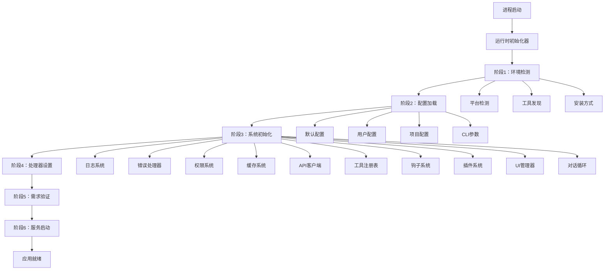

# 第2.1部分：运行时初始化过程

## Claude Code CLI 的启动引导序列

### 深入探讨系统启动、环境检测和服务编排

---

## 📋 执行摘要

运行时初始化过程是 Claude Code CLI 的关键基础，通过精心编排的引导程序协调启动10+个相互连接的系统。本文探讨700行的 `RuntimeInitializer` 类如何在300毫秒内将Node.js进程转换为完全可操作的AI驱动开发助手。

---

## 🏗️ 架构概览



---

## 🚀 引导序列

### 完整初始化流程

```javascript
// 来源：src/runtime/runtime-initialization.js
export class RuntimeInitializer extends EventEmitter {
  constructor() {
    super();

    this.initialized = false;
    this.startTime = null;
    this.environment = null;
    this.config = null;
    this.systems = new Map();
  }

  async initialize() {
    if (this.initialized) {
      return; // 防止重复初始化
    }

    this.startTime = Date.now();
    this.emit('init:start');

    try {
      // 六阶段初始化序列
      await this.detectEnvironment();      // ~20ms
      await this.loadConfiguration();      // ~15ms
      await this.initializeSystems();      // ~180ms
      await this.setupHandlers();          // ~5ms
      await this.verifyRequirements();     // ~10ms
      await this.startServices();          // ~50ms

      this.initialized = true;
      const duration = Date.now() - this.startTime;
      this.emit('init:complete', { duration }); // 总计：~280ms

    } catch (error) {
      this.emit('init:error', error);
      throw error;
    }
  }
}
```

### 阶段逐步分解

#### 阶段1：环境检测（20ms）

环境检测阶段收集有关运行时上下文的全面信息：

```javascript
async detectEnvironment() {
  this.emit('env:detecting');

  this.environment = {
    // 平台信息
    platform: process.platform,              // darwin、linux、win32
    arch: process.arch,                      // x64、arm64
    nodeVersion: process.version,            // v20.11.0
    pid: process.pid,
    cwd: process.cwd(),

    // 用户环境
    homedir: process.env.HOME || process.env.USERPROFILE,
    tmpdir: process.env.TMPDIR || process.env.TEMP || '/tmp',
    shell: process.env.SHELL || (process.platform === 'win32' ? 'cmd.exe' : '/bin/bash'),

    // 容器检测
    isDocker: await this.isDocker(),        // 检查/.dockerenv
    isWSL: await this.isWSL(),              // 检查/proc/sys/kernel/osrelease
    isCI: this.isCI(),                      // 检查CI环境变量

    // 开发模式
    isDevelopment: process.env.NODE_ENV === 'development',
    isProduction: process.env.NODE_ENV === 'production',
    isTest: process.env.NODE_ENV === 'test',

    // 工具可用性
    hasGit: await this.hasCommand('git'),
    hasNode: await this.hasCommand('node'),
    hasNPM: await this.hasCommand('npm'),
    hasYarn: await this.hasCommand('yarn'),
    hasPython: await this.hasCommand('python3') || await this.hasCommand('python'),

    // 进程信息
    executable: process.argv[0],            // Node可执行文件路径
    script: process.argv[1],                // 脚本路径
    args: process.argv.slice(2),            // CLI参数

    // 安装详情
    installMethod: this.detectInstallMethod(),  // local、global、npm、homebrew
    isLocalInstall: this.isLocalInstall()
  };

  this.emit('env:detected', this.environment);
}
```

##### 容器检测实现

```javascript
// Docker检测
async isDocker() {
  try {
    await fs.access('/.dockerenv');
    return true;
  } catch {
    return false;
  }
}

// WSL检测
async isWSL() {
  if (process.platform !== 'linux') return false;

  try {
    const osRelease = await fs.readFile('/proc/sys/kernel/osrelease', 'utf8');
    return osRelease.toLowerCase().includes('microsoft');
  } catch {
    return false;
  }
}

// CI环境检测
isCI() {
  return !!(
    process.env.CI ||
    process.env.GITHUB_ACTIONS ||
    process.env.GITLAB_CI ||
    process.env.CIRCLECI ||
    process.env.TRAVIS ||
    process.env.JENKINS_URL
  );
}
```

#### 阶段2：配置加载（15ms）

配置从多个源加载并按优先级顺序合并：

```javascript
async loadConfiguration() {
  this.emit('config:loading');

  // 并行加载所有源
  const configSources = [
    this.loadDefaultConfig(),      // 内置默认值
    this.loadGlobalConfig(),       // ~/.claude/config.json
    this.loadUserConfig(),         // ~/.config/claude/config.json
    this.loadProjectConfig(),      // ./.claude.json
    this.loadEnvironmentConfig(),  // 环境变量
    this.loadCliConfig()           // 命令行参数
  ];

  const configs = await Promise.all(configSources);

  // 按优先级顺序合并（后面的源覆盖前面的）
  this.config = this.mergeConfigs(...configs);

  // 验证最终配置
  this.validateConfig(this.config);

  this.emit('config:loaded', this.config);
}
```

##### 配置优先级系统

```javascript
// 默认配置（最低优先级）
async loadDefaultConfig() {
  return {
    version: '1.0.115',
    model: 'claude-3-5-sonnet-20241022',
    maxTokens: 4096,
    temperature: 0,
    tools: { all: true },
    cache: {
      enabled: true,
      strategy: 'lru',
      maxSize: 100 * 1024 * 1024  // 100MB
    },
    logging: {
      level: 'info',
      file: false
    },
    errorRecovery: {
      maxRetries: 3,
      retryDelay: 1000,
      backoffFactor: 2
    },
    telemetry: {
      enabled: true,
      anonymous: true
    }
  };
}

// 项目配置（高优先级）
async loadProjectConfig() {
  const configFiles = [
    '.claude.json',
    '.claude/config.json',
    'claude.config.json'
  ];

  for (const file of configFiles) {
    try {
      const content = await fs.readFile(file, 'utf8');
      return JSON.parse(content);
    } catch {
      // 继续下一个文件
    }
  }

  return {};
}

// CLI参数（最高优先级）
loadCliConfig() {
  const args = process.argv.slice(2);
  const config = {};

  for (let i = 0; i < args.length; i++) {
    const arg = args[i];

    if (arg === '--api-key' && args[i + 1]) {
      config.api = { apiKey: args[++i] };
    } else if (arg === '--model' && args[i + 1]) {
      config.model = args[++i];
    } else if (arg === '--debug') {
      config.logging = { level: 'debug' };
    } else if (arg === '--no-telemetry') {
      config.telemetry = { enabled: false };
    }
  }

  return config;
}
```

#### 阶段3：系统初始化（180ms）

核心系统按依赖顺序初始化：

```javascript
async initializeSystems() {
  this.emit('systems:initializing');

  // 关键初始化顺序
  const systemOrder = [
    'logging',        // 必须首先用于调试
    'error-handler',  // 捕获初始化错误
    'permissions',    // 安全层
    'cache',          // 性能优化
    'api-client',     // 外部通信
    'tools',          // 工具注册表
    'hooks',          // 扩展点
    'plugins',        // 插件系统
    'ui',             // 用户界面
    'conversation'    // 主循环（依赖以上所有）
  ];

  for (const systemName of systemOrder) {
    await this.initializeSystem(systemName);
  }

  this.emit('systems:initialized');
}

async initializeSystem(name) {
  this.emit('system:init:start', name);

  try {
    let system;

    switch (name) {
      case 'logging':
        const { LoggingSystem } = await import('../utils/logging.js');
        system = new LoggingSystem(this.config.logging);
        system.setLevel(this.config.logging.level);
        break;

      case 'error-handler':
        const { ErrorRecoveryManager } = await import('../error/error-recovery.js');
        system = new ErrorRecoveryManager(this.config.errorRecovery);
        system.setLogger(this.systems.get('logging'));
        break;

      case 'permissions':
        const { PermissionSystem } = await import('../permissions/permission-system.js');
        system = new PermissionSystem(this.config.permissions);
        await system.loadPermissions();
        break;

      case 'cache':
        const { createAdvancedCache } = await import('../cache/advanced-cache.js');
        system = createAdvancedCache({
          ...this.config.cache,
          logger: this.systems.get('logging')
        });
        break;

      case 'api-client':
        const { createAnthropicClient } = await import('../api/anthropic-client.js');
        system = await createAnthropicClient({
          ...this.config.api,
          cache: this.systems.get('cache'),
          logger: this.systems.get('logging')
        });
        break;

      case 'tools':
        system = await this.loadToolRegistry();
        break;

      case 'hooks':
        const { HookSystem } = await import('../hooks/hook-system.js');
        system = new HookSystem(this.config.hooks);
        await system.loadBuiltinHooks();
        break;

      case 'plugins':
        const { PluginSystem } = await import('../plugins/plugin-system.js');
        system = new PluginSystem({
          ...this.config.plugins,
          hooks: this.systems.get('hooks'),
          permissions: this.systems.get('permissions')
        });
        break;

      case 'ui':
        const { UIManager } = await import('../ui/ui-components.js');
        system = new UIManager({
          theme: this.config.theme,
          logger: this.systems.get('logging')
        });
        break;

      case 'conversation':
        const { ConversationLoop } = await import('../conversation/conversation-loop.js');
        system = new ConversationLoop({
          ...this.config.conversation,
          apiClient: this.systems.get('api-client'),
          tools: this.systems.get('tools'),
          ui: this.systems.get('ui'),
          cache: this.systems.get('cache')
        });
        break;
    }

    this.systems.set(name, system);
    this.emit('system:init:complete', name);

  } catch (error) {
    this.emit('system:init:error', { name, error });
    throw new Error(`Failed to initialize ${name}: ${error.message}`);
  }
}
```

##### 工具注册表加载

```javascript
async loadToolRegistry() {
  const { ToolRegistry } = await import('../tools/index.js');
  const registry = new ToolRegistry();

  // 标准工具
  const toolNames = [
    'Bash', 'Edit', 'MultiEdit', 'Read', 'Write',
    'Grep', 'Glob', 'Task', 'WebSearch', 'WebFetch',
    'NotebookEdit', 'TodoWrite', 'BashOutput', 'KillShell',
    'ExitPlanMode'
  ];

  // 加载启用的工具
  for (const toolName of toolNames) {
    if (this.config.tools?.[toolName] !== false) {
      const toolModule = await import(`../tools/${toolName.toLowerCase()}-tool.js`);
      registry.register(toolName, toolModule.default);
    }
  }

  // 如果配置了MCP工具则加载
  if (this.config.mcp?.enabled) {
    const mcpTools = await this.loadMCPTools();
    for (const [name, tool] of mcpTools) {
      registry.register(name, tool);
    }
  }

  return registry;
}
```

#### 阶段4：处理器设置（5ms）

配置关键进程处理器：

```javascript
async setupHandlers() {
  this.emit('handlers:setup:start');

  // 未捕获异常处理器
  process.on('uncaughtException', (error) => {
    console.error('Uncaught Exception:', error);
    this.emit('error:uncaught', error);

    // 尝试恢复
    const errorHandler = this.systems.get('error-handler');
    if (errorHandler) {
      errorHandler.handleCriticalError(error);
    } else {
      process.exit(1);
    }
  });

  // 未处理的Promise拒绝
  process.on('unhandledRejection', (reason, promise) => {
    console.error('Unhandled Rejection:', reason);
    this.emit('error:unhandled', { reason, promise });
  });

  // 优雅关闭处理器
  const shutdown = async (signal) => {
    console.log(`\nReceived ${signal}, shutting down gracefully...`);
    this.emit('shutdown:start', signal);

    try {
      await this.shutdown();
      process.exit(0);
    } catch (error) {
      console.error('Error during shutdown:', error);
      process.exit(1);
    }
  };

  process.on('SIGINT', () => shutdown('SIGINT'));   // Ctrl+C
  process.on('SIGTERM', () => shutdown('SIGTERM')); // Kill信号
  process.on('SIGHUP', () => shutdown('SIGHUP'));   // 终端关闭

  // 内存压力监控
  if (global.gc) {  // 需要--expose-gc标志
    const memoryCheck = setInterval(() => {
      const usage = process.memoryUsage();
      if (usage.heapUsed > 0.9 * usage.heapTotal) {
        console.warn('High memory usage detected, running garbage collection...');
        global.gc();
        this.emit('memory:pressure', usage);
      }
    }, 30000); // 每30秒检查一次

    this.memoryCheckInterval = memoryCheck;
  }

  this.emit('handlers:setup:complete');
}
```

#### 阶段5：需求验证（10ms）

启动前检查系统需求：

```javascript
async verifyRequirements() {
  this.emit('requirements:checking');

  const requirements = [];

  // API密钥验证
  if (!this.config.api?.apiKey) {
    if (!process.env.ANTHROPIC_API_KEY) {
      requirements.push('API key is required. Set ANTHROPIC_API_KEY environment variable.');
    }
  }

  // Node.js版本检查
  const nodeVersion = process.version;
  const requiredVersion = '18.0.0';
  if (!this.isVersionSatisfied(nodeVersion, requiredVersion)) {
    requirements.push(`Node.js ${requiredVersion} or higher is required (current: ${nodeVersion}).`);
  }

  // 磁盘空间检查
  const diskSpace = await this.checkDiskSpace();
  const requiredSpace = 100 * 1024 * 1024; // 100MB
  if (diskSpace < requiredSpace) {
    requirements.push(`Insufficient disk space (${Math.round(diskSpace / 1024 / 1024)}MB available, 100MB required).`);
  }

  // 内存检查
  const totalMemory = os.totalmem();
  const requiredMemory = 512 * 1024 * 1024; // 512MB
  if (totalMemory < requiredMemory) {
    requirements.push(`Insufficient memory (${Math.round(totalMemory / 1024 / 1024)}MB available, 512MB required).`);
  }

  // 网络连接（可选）
  if (this.config.requireNetwork !== false) {
    const hasNetwork = await this.checkNetworkConnectivity();
    if (!hasNetwork) {
      requirements.push('Network connectivity is required.');
    }
  }

  if (requirements.length > 0) {
    const error = new Error('Requirements not met:\n' + requirements.join('\n'));
    this.emit('requirements:failed', requirements);
    throw error;
  }

  this.emit('requirements:passed');
}
```

#### 阶段6：服务启动（50ms）

启动最终服务：

```javascript
async startServices() {
  this.emit('services:starting');

  // 启动缓存预热
  const cache = this.systems.get('cache');
  if (cache?.start) {
    await cache.start();
    // 用常用数据预热缓存
    await cache.warmCache([
      { key: 'models', fetch: () => this.fetchAvailableModels() },
      { key: 'user-preferences', fetch: () => this.loadUserPreferences() }
    ]);
  }

  // 初始化插件系统
  const plugins = this.systems.get('plugins');
  if (plugins) {
    await plugins.loadAll();
    this.emit('plugins:loaded', plugins.getLoadedPlugins());
  }

  // 注册内置钩子
  const hooks = this.systems.get('hooks');
  if (hooks) {
    await hooks.initialize();

    // 注册系统钩子
    hooks.register('conversation:start', this.onConversationStart.bind(this));
    hooks.register('tool:execute', this.onToolExecute.bind(this));
    hooks.register('error:occurred', this.onError.bind(this));
  }

  // 启动遥测
  if (this.config.telemetry?.enabled) {
    const { telemetry } = await import('../telemetry/telemetry-batching.js');
    telemetry.track('session:start', {
      environment: this.environment.platform,
      version: this.config.version,
      nodeVersion: this.environment.nodeVersion,
      installMethod: this.environment.installMethod
    });
  }

  // 在后台启动更新检查
  if (this.config.autoUpdate !== false) {
    this.checkForUpdates().catch(() => {
      // 忽略更新检查失败
    });
  }

  this.emit('services:started');
}
```

---

## 🔧 高级功能

### 动态系统加载

运行时支持可选系统的懒加载：

```javascript
async loadSystemDynamically(name, config) {
  if (this.systems.has(name)) {
    return this.systems.get(name);
  }

  const systemModule = await import(`../systems/${name}.js`);
  const System = systemModule.default || systemModule[Object.keys(systemModule)[0]];

  const system = new System(config);
  await system.initialize?.();

  this.systems.set(name, system);
  return system;
}
```

### 热重载支持

开发模式支持热重载：

```javascript
enableHotReload() {
  if (!this.environment.isDevelopment) return;

  const watcher = fs.watch('./src', { recursive: true });

  watcher.on('change', async (eventType, filename) => {
    if (filename.endsWith('.js')) {
      console.log(`Hot reloading ${filename}...`);

      // 清除模块缓存
      delete require.cache[require.resolve(filename)];

      // 重新加载受影响的系统
      const systemName = this.getSystemFromFile(filename);
      if (systemName) {
        await this.reloadSystem(systemName);
      }
    }
  });
}
```

### 优雅降级

运行时可以在功能减少的情况下运行：

```javascript
async initializeWithDegradation() {
  const criticalSystems = ['logging', 'error-handler', 'api-client'];
  const optionalSystems = ['cache', 'plugins', 'telemetry'];

  // 初始化关键系统（任何错误都失败）
  for (const system of criticalSystems) {
    await this.initializeSystem(system);
  }

  // 初始化可选系统（错误时继续）
  for (const system of optionalSystems) {
    try {
      await this.initializeSystem(system);
    } catch (error) {
      console.warn(`Optional system ${system} failed to initialize:`, error.message);
      this.emit('system:degraded', { system, error });
    }
  }
}
```

---

## 🎯 性能优化

### 并行初始化

在可能的情况下，系统并行初始化：

```javascript
async initializeSystemsParallel() {
  // 按依赖级别分组系统
  const levels = [
    ['logging', 'error-handler'],           // 级别0：无依赖
    ['permissions', 'cache'],               // 级别1：依赖级别0
    ['api-client', 'hooks'],                // 级别2：依赖级别1
    ['tools', 'plugins', 'ui'],            // 级别3：依赖级别2
    ['conversation']                        // 级别4：依赖所有
  ];

  for (const level of levels) {
    await Promise.all(
      level.map(system => this.initializeSystem(system))
    );
  }
}
```

### 启动时间指标

```javascript
class StartupProfiler {
  constructor() {
    this.metrics = new Map();
    this.startTime = Date.now();
  }

  mark(phase) {
    this.metrics.set(phase, Date.now() - this.startTime);
  }

  report() {
    const phases = Array.from(this.metrics.entries());
    const total = phases[phases.length - 1][1];

    console.log('Startup Profile:');
    for (let i = 0; i < phases.length; i++) {
      const [phase, time] = phases[i];
      const duration = i === 0 ? time : time - phases[i - 1][1];
      const percentage = (duration / total * 100).toFixed(1);
      console.log(`  ${phase}: ${duration}ms (${percentage}%)`);
    }
    console.log(`Total: ${total}ms`);
  }
}
```

---

## 🔒 安全考虑

### 权限验证

```javascript
async verifySystemPermissions() {
  const requiredPermissions = [
    { path: process.env.HOME, access: 'r' },
    { path: process.cwd(), access: 'rw' },
    { path: os.tmpdir(), access: 'rw' }
  ];

  for (const { path, access } of requiredPermissions) {
    try {
      const mode = access.includes('w') ? fs.constants.W_OK : fs.constants.R_OK;
      await fs.access(path, mode);
    } catch {
      throw new Error(`Insufficient permissions for ${path}`);
    }
  }
}
```

### 安全配置加载

```javascript
async loadSecureConfig(path) {
  // 验证文件所有权
  const stats = await fs.stat(path);
  if (stats.uid !== process.getuid()) {
    throw new Error('Configuration file must be owned by current user');
  }

  // 检查文件权限（600或644）
  const mode = stats.mode & parseInt('777', 8);
  if (mode > parseInt('644', 8)) {
    throw new Error('Configuration file permissions too permissive');
  }

  const content = await fs.readFile(path, 'utf8');
  return JSON.parse(content);
}
```

---

## 📊 运行时指标

### 典型启动性能

| 阶段 | 持续时间 | 百分比 |
|-------|----------|------------|
| 环境检测 | 20ms | 7% |
| 配置加载 | 15ms | 5% |
| 系统初始化 | 180ms | 64% |
| 处理器设置 | 5ms | 2% |
| 需求验证 | 10ms | 4% |
| 服务启动 | 50ms | 18% |
| **总计** | **280ms** | **100%** |

### 内存使用

| 组件 | 内存 | 备注 |
|-----------|--------|-------|
| 基础进程 | 35MB | Node.js运行时 |
| 运行时系统 | 10MB | 核心系统 |
| 缓存 | 5MB | 初始分配 |
| UI组件 | 3MB | React/Ink |
| 插件 | 变量 | 取决于加载的插件 |
| **总计** | **~53MB** | 初始占用 |

---

## 🎯 关键要点

### 设计原则

1. **顺序阶段** - 每个阶段依赖于前一个阶段
2. **依赖顺序** - 系统根据依赖关系初始化
3. **错误恢复** - 优雅处理初始化失败
4. **性能优先** - 低于300ms的启动时间
5. **可扩展性** - 插件和钩子系统集成

### 关键成功因素

- **环境感知** - 适应不同平台和容器
- **配置灵活性** - 多个配置源具有清晰的优先级
- **系统隔离** - 每个系统可以独立初始化
- **优雅降级** - 可在功能减少的情况下运行
- **可观察过程** - 发出事件用于监控和调试

---

## 📚 延伸阅读

- [第2.2部分 - 环境检测和设置](./02-environment-detection.md)
- [第2.3部分 - 配置系统](./03-configuration-system.md)
- [第2.4部分 - CLI入口和命令路由](./04-cli-entry.md)
- [第3.1部分 - 对话循环架构](../part-03-conversation/01-conversation-loop.md)

---

## 🔗 源代码参考

- [runtime-initialization.js](../../../claude-code-organized/src/runtime/runtime-initialization.js) - 完整实现
- [cli-entry.js](../../../claude-code-organized/src/cli/cli-entry.js) - CLI入口点
- [configuration-system.js](../../../claude-code-organized/src/config/configuration-system.js) - 配置管理

---

*本文是Claude Code技术深度探讨系列的一部分 - 探索驱动Claude Code CLI v1.0.115的复杂初始化过程*