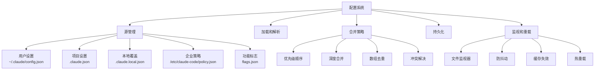

# 第2.3部分：配置系统实现

## 具有优先级合并功能的多源配置管理

### Claude Code 如何管理用户、项目和企业级别的设置

---

## 📋 执行摘要

Claude Code 的配置系统实现了一个复杂的多源、基于优先级的配置管理系统，可以合并来自5个不同源的设置。本深度探讨探索了440行的实现，该实现处理用户偏好、项目设置、企业策略和功能标志，具有自动迁移、验证和热重载功能。

---

## 🏗️ 配置架构



---

## 📂 配置源

### 五层配置层次结构

```javascript
// 来源：src/config/configuration-system.js
const CONFIG_SOURCES = [
  'userSettings',     // 用户级设置 (~/.claude/config.json)
  'projectSettings',  // 项目特定设置 (.claude.json)
  'localSettings',    // 本地项目覆盖 (.claude.local.json)
  'policySettings',   // 组织/企业策略 (/etc/claude-code/policy.json)
  'flagSettings'      // 功能标志 (flags.json)
];

// 配置文件映射
const CONFIG_FILES = {
  userSettings: 'config.json',
  projectSettings: '.claude.json',
  localSettings: '.claude.local.json',
  policySettings: 'policy.json',
  flagSettings: 'flags.json'
};
```

### 配置路径解析

```javascript
function getConfigPath(source) {
  switch (source) {
    case 'userSettings':
      // 用户主目录配置
      return join(getUserConfigDirectory(), CONFIG_FILES[source]);

    case 'projectSettings':
    case 'localSettings':
      // 项目根配置
      return join(getCurrentWorkingDirectory(), CONFIG_FILES[source]);

    case 'policySettings':
      // 系统级策略位置
      return getPolicyPath();

    case 'flagSettings':
      // 功能标志目录（环境变量）
      const flagDir = getFlagDirectory();
      return flagDir ? join(flagDir, CONFIG_FILES[source]) : null;

    default:
      return null;
  }
}

// 平台特定策略路径
function getPolicyPath() {
  const platform = process.platform;

  switch (platform) {
    case 'darwin':
      return '/Library/Application Support/ClaudeCode/policy.json';

    case 'win32':
      return 'C:\\ProgramData\\ClaudeCode\\policy.json';

    default: // Linux和其他
      return '/etc/claude-code/policy.json';
  }
}

// 用户配置目录
function getUserConfigDirectory() {
  const home = process.env.HOME || process.env.USERPROFILE;
  return join(home, '.claude');
}

// 功能标志目录（可选）
function getFlagDirectory() {
  return process.env.CLAUDE_FLAGS_DIR || null;
}
```

---

## 🔄 配置加载

### 带验证的安全配置加载

```javascript
function loadConfig(source) {
  const configPath = getConfigPath(source);

  if (!configPath || !fs.existsSync(configPath)) {
    return null;
  }

  try {
    const content = fs.readFileSync(configPath, 'utf8');
    const parsed = JSON.parse(content);

    // 验证配置
    if (!validateConfig(parsed)) {
      console.error(`Invalid configuration in ${configPath}`);
      return null;
    }

    // 应用源特定转换
    return transformConfigForSource(parsed, source);

  } catch (error) {
    console.error(`Failed to load config from ${configPath}:`, error);
    return null;
  }
}

// 配置验证
function validateConfig(config) {
  if (!config || typeof config !== 'object') {
    return false;
  }

  // 验证特定字段
  const validations = [
    validateApiConfiguration,
    validateToolConfiguration,
    validatePermissionConfiguration,
    validateModelConfiguration
  ];

  for (const validator of validations) {
    if (!validator(config)) {
      return false;
    }
  }

  return true;
}

// 验证API配置
function validateApiConfiguration(config) {
  if (!config.api) return true; // 可选

  const api = config.api;

  // 如果存在，验证API密钥格式
  if (api.apiKey && typeof api.apiKey !== 'string') {
    return false;
  }

  // 如果存在，验证基础URL
  if (api.baseUrl) {
    try {
      new URL(api.baseUrl);
    } catch {
      return false;
    }
  }

  // 验证超时
  if (api.timeout && (typeof api.timeout !== 'number' || api.timeout < 0)) {
    return false;
  }

  return true;
}

// 验证模型配置
function validateModelConfiguration(config) {
  if (!config.model) return true;

  const validModels = [
    'claude-3-5-sonnet-20241022',
    'claude-3-opus-20240229',
    'claude-3-sonnet-20240229',
    'claude-3-haiku-20240307'
  ];

  if (!validModels.includes(config.model)) {
    console.warn(`Unknown model: ${config.model}`);
  }

  return true;
}
```

---

## 🔀 配置合并

### 具有优先级系统的深度合并

```javascript
function getMergedConfiguration() {
  // 如果可用，返回缓存
  if (configCache !== null) {
    return configCache;
  }

  let merged = {};
  const loadedConfigs = [];
  const seenPaths = new Set();

  // 按优先级顺序加载配置（从低到高）
  for (const source of CONFIG_SOURCES) {
    const configPath = getConfigPath(source);

    if (!configPath) continue;

    const normalized = normalizePath(configPath);

    // 如果已加载则跳过（用于去重）
    if (seenPaths.has(normalized)) continue;

    seenPaths.add(normalized);

    const config = loadConfig(source);

    if (config) {
      // 应用源优先级权重
      const priority = getSourcePriority(source);
      loadedConfigs.push({ source, config, priority });
    }
  }

  // 按优先级排序并合并
  loadedConfigs.sort((a, b) => a.priority - b.priority);

  for (const { config, source } of loadedConfigs) {
    merged = mergeConfigurations(merged, config, source);
  }

  // 应用配置迁移
  merged = migrateConfiguration(merged);

  // 应用策略约束
  merged = applyPolicyConstraints(merged);

  // 缓存结果
  configCache = merged;

  return merged;
}

// 源优先级级别
function getSourcePriority(source) {
  const priorities = {
    'flagSettings': 1,      // 最低 - 功能标志
    'policySettings': 2,    // 企业策略
    'userSettings': 3,      // 用户偏好
    'projectSettings': 4,   // 项目配置
    'localSettings': 5      // 最高 - 本地覆盖
  };

  return priorities[source] || 0;
}
```

### 智能深度合并

```javascript
function mergeConfigurations(base, override, source) {
  const result = { ...base };

  for (const [key, value] of Object.entries(override)) {
    // 处理特殊合并策略
    const strategy = getMergeStrategy(key, source);

    switch (strategy) {
      case 'replace':
        // 完全替换
        result[key] = value;
        break;

      case 'append':
        // 追加到数组
        result[key] = [...(result[key] || []), ...value];
        break;

      case 'merge':
        // 深度合并对象
        if (value && typeof value === 'object' && !Array.isArray(value)) {
          result[key] = mergeConfigurations(result[key] || {}, value, source);
        } else {
          result[key] = value;
        }
        break;

      case 'union':
        // 数组联合（去重）
        result[key] = mergeArrays(result[key], value);
        break;

      case 'delete':
        // 如果未定义则删除
        if (value === undefined) {
          delete result[key];
        }
        break;

      default:
        // 默认：覆盖
        result[key] = value;
    }
  }

  return result;
}

// 确定键的合并策略
function getMergeStrategy(key, source) {
  // 策略设置有特殊规则
  if (source === 'policySettings') {
    if (key === 'permissions') return 'replace'; // 策略覆盖权限
    if (key === 'tools') return 'merge';         // 合并工具配置
  }

  // 按键的标准策略
  const strategies = {
    'permissions': 'merge',
    'tools': 'merge',
    'hooks': 'append',
    'plugins': 'union',
    'env': 'merge',
    'features': 'merge'
  };

  return strategies[key] || 'replace';
}

// 带去重的合并数组
function mergeArrays(base, override) {
  const combined = [...(base || []), ...override];
  return Array.from(new Set(combined));
}
```

---

## 💾 配置持久化

### 安全配置保存

```javascript
function saveConfig(source, config) {
  // 验证源是否可保存
  if (!canSaveSource(source)) {
    return {
      error: `Cannot save to ${source}: read-only source`
    };
  }

  const configPath = getConfigPath(source);

  if (!configPath) {
    return { error: 'Invalid configuration source' };
  }

  try {
    const dir = dirname(configPath);

    // 如果目录不存在则创建
    if (!fs.existsSync(dir)) {
      fs.mkdirSync(dir, { recursive: true });
    }

    // 加载现有配置以进行部分更新
    const existing = loadConfig(source) || {};

    // 与现有配置合并（保留未修改的字段）
    const merged = mergeConfigurations(existing, config, source);

    // 保存前验证
    if (!validateConfig(merged)) {
      return { error: 'Configuration validation failed' };
    }

    // 创建现有配置的备份
    if (fs.existsSync(configPath)) {
      const backupPath = `${configPath}.backup`;
      fs.copyFileSync(configPath, backupPath);
    }

    // 原子性写入配置
    const tempPath = `${configPath}.tmp`;
    fs.writeFileSync(
      tempPath,
      JSON.stringify(merged, null, 2),
      'utf8'
    );

    // 原子性重命名
    fs.renameSync(tempPath, configPath);

    // 保存时清除缓存
    clearConfigCache();

    // 发出配置更改事件
    emitConfigChange(source, merged);

    return { error: null, config: merged };

  } catch (error) {
    console.error(`Failed to save config to ${configPath}:`, error);
    return { error: error.message };
  }
}

// 检查源是否可保存
function canSaveSource(source) {
  // 策略和标志设置是只读的
  const readOnlySources = ['policySettings', 'flagSettings'];
  return !readOnlySources.includes(source);
}

// 清除配置缓存
function clearConfigCache() {
  configCache = null;
}
```

---

## 🔄 配置迁移

### 自动配置更新

```javascript
function migrateConfiguration(config) {
  let migrated = { ...config };
  let version = migrated.configVersion || 0;

  // 按顺序应用迁移
  const migrations = [
    migrateV0ToV1,
    migrateV1ToV2,
    migrateV2ToV3
  ];

  for (let i = version; i < migrations.length; i++) {
    migrated = migrations[i](migrated);
  }

  // 更新版本
  migrated.configVersion = migrations.length;

  return migrated;
}

// 迁移：v0到v1 - 重命名遗留键
function migrateV0ToV1(config) {
  const migrated = { ...config };

  // 将'allowedTools'迁移到'permissions'
  if ('allowedTools' in migrated && !('permissions' in migrated)) {
    migrated.permissions = {
      tools: {
        allow: migrated.allowedTools || []
      }
    };
    delete migrated.allowedTools;
  }

  // 将'ignorePatterns'迁移到权限
  if ('ignorePatterns' in migrated) {
    migrated.permissions = migrated.permissions || {};
    migrated.permissions.paths = {
      deny: migrated.ignorePatterns || []
    };
    delete migrated.ignorePatterns;
  }

  return migrated;
}

// 迁移：v1到v2 - 更新模型名称
function migrateV1ToV2(config) {
  const migrated = { ...config };

  // 更新旧模型名称
  const modelMigration = {
    'claude-2': 'claude-3-5-sonnet-20241022',
    'claude-instant': 'claude-3-haiku-20240307',
    'claude-v1': 'claude-3-opus-20240229'
  };

  if (migrated.model && modelMigration[migrated.model]) {
    migrated.model = modelMigration[migrated.model];
  }

  return migrated;
}

// 迁移：v2到v3 - 重构工具配置
function migrateV2ToV3(config) {
  const migrated = { ...config };

  // 将平面工具列表迁移到分类结构
  if (migrated.tools && Array.isArray(migrated.tools)) {
    const toolCategories = {
      filesystem: ['Read', 'Write', 'Edit', 'MultiEdit'],
      execution: ['Bash', 'BashOutput', 'KillShell'],
      search: ['Grep', 'Glob', 'WebSearch', 'WebFetch'],
      special: ['Task', 'NotebookEdit', 'TodoWrite']
    };

    const oldTools = migrated.tools;
    migrated.tools = {};

    for (const [category, tools] of Object.entries(toolCategories)) {
      migrated.tools[category] = tools.filter(tool =>
        oldTools.includes(tool)
      );
    }
  }

  return migrated;
}
```

---

## 👀 配置监视

### 带文件监视的热重载

```javascript
class ConfigWatcher {
  constructor(callback) {
    this.callback = callback;
    this.watchers = new Map();
    this.debounceTimer = null;
    this.debounceDelay = 100;
    this.changeQueue = new Set();
  }

  start() {
    // 监视所有配置源
    for (const source of CONFIG_SOURCES) {
      this.watchSource(source);
    }

    // 也监视父目录以发现新文件
    this.watchDirectories();
  }

  watchSource(source) {
    const path = getConfigPath(source);

    if (!path) return;

    try {
      // 检查文件是否存在
      if (fs.existsSync(path)) {
        const watcher = fs.watch(path, (eventType) => {
          this.handleChange(source, eventType, path);
        });

        this.watchers.set(source, watcher);
      } else {
        // 监视父目录以发现文件创建
        const dir = dirname(path);
        if (fs.existsSync(dir)) {
          this.watchDirectoryForFile(dir, basename(path), source);
        }
      }
    } catch (error) {
      console.error(`Failed to watch ${source}:`, error);
    }
  }

  watchDirectoryForFile(dir, filename, source) {
    const key = `dir:${source}`;

    if (this.watchers.has(key)) return;

    const watcher = fs.watch(dir, (eventType, changedFile) => {
      if (changedFile === filename) {
        // 文件被创建/删除
        this.handleChange(source, eventType, join(dir, filename));

        // 如果创建，切换到文件监视器
        if (eventType === 'rename' && fs.existsSync(join(dir, filename))) {
          watcher.close();
          this.watchers.delete(key);
          this.watchSource(source);
        }
      }
    });

    this.watchers.set(key, watcher);
  }

  handleChange(source, eventType, path) {
    // 添加到更改队列
    this.changeQueue.add({ source, eventType, path });

    // 防抖多个快速更改
    if (this.debounceTimer) {
      clearTimeout(this.debounceTimer);
    }

    this.debounceTimer = setTimeout(() => {
      this.processChanges();
    }, this.debounceDelay);
  }

  processChanges() {
    // 清除缓存
    clearConfigCache();

    // 处理所有排队的更改
    const changes = Array.from(this.changeQueue);
    this.changeQueue.clear();

    // 重新加载配置
    const newConfig = getMergedConfiguration();

    // 通知回调更改
    this.callback({
      changes,
      config: newConfig,
      timestamp: Date.now()
    });

    this.debounceTimer = null;
  }

  stop() {
    // 关闭所有监视器
    for (const watcher of this.watchers.values()) {
      watcher.close();
    }

    this.watchers.clear();

    // 清除挂起的计时器
    if (this.debounceTimer) {
      clearTimeout(this.debounceTimer);
      this.debounceTimer = null;
    }

    // 清除队列
    this.changeQueue.clear();
  }
}
```

---

## 🎛️ 高级功能

### 策略强制执行

```javascript
function applyPolicyConstraints(config) {
  const policy = loadConfig('policySettings');

  if (!policy) return config;

  let constrained = { ...config };

  // 应用策略约束
  if (policy.enforce) {
    // 强制必需设置
    if (policy.enforce.required) {
      for (const [key, value] of Object.entries(policy.enforce.required)) {
        constrained[key] = value; // 策略覆盖
      }
    }

    // 强制禁止设置
    if (policy.enforce.forbidden) {
      for (const key of policy.enforce.forbidden) {
        delete constrained[key];
      }
    }

    // 强制允许的值
    if (policy.enforce.allowedValues) {
      for (const [key, allowed] of Object.entries(policy.enforce.allowedValues)) {
        if (constrained[key] && !allowed.includes(constrained[key])) {
          constrained[key] = allowed[0]; // 使用第一个允许的值
        }
      }
    }
  }

  return constrained;
}
```

### Frontmatter 配置

```javascript
function parseFrontmatter(content) {
  const frontmatterRegex = /^---\s*\n([\s\S]*?)---\s*\n?/;
  const match = content.match(frontmatterRegex);

  if (!match) {
    return { frontmatter: {}, content };
  }

  const frontmatterText = match[1];
  const mainContent = content.slice(match[0].length);
  const frontmatter = {};

  // 解析类似YAML的frontmatter
  const lines = frontmatterText.split('\n');

  for (const line of lines) {
    const colonIndex = line.indexOf(':');

    if (colonIndex > 0) {
      const key = line.slice(0, colonIndex).trim();
      const value = line.slice(colonIndex + 1).trim();

      if (key) {
        // 解析值类型
        frontmatter[key] = parseValue(value);
      }
    }
  }

  return { frontmatter, content: mainContent };
}

function parseValue(value) {
  // 如果存在引号则移除
  const cleanValue = value.replace(/^["']|["']$/g, '');

  // 解析布尔值
  if (cleanValue === 'true') return true;
  if (cleanValue === 'false') return false;

  // 解析数字
  const num = Number(cleanValue);
  if (!isNaN(num) && cleanValue !== '') return num;

  // 解析数组
  if (cleanValue.startsWith('[') && cleanValue.endsWith(']')) {
    try {
      return JSON.parse(cleanValue);
    } catch {
      // 回退到字符串
    }
  }

  return cleanValue;
}
```

---

## 📊 配置结构

### 完整配置结构

```javascript
const CONFIG_SCHEMA = {
  // API配置
  api: {
    apiKey: 'string',
    baseUrl: 'string',
    timeout: 'number',
    retries: 'number'
  },

  // 模型选择
  model: 'string',
  maxTokens: 'number',
  temperature: 'number',

  // 工具配置
  tools: {
    filesystem: ['array', 'string'],
    execution: ['array', 'string'],
    search: ['array', 'string'],
    special: ['array', 'string']
  },

  // 权限
  permissions: {
    tools: {
      allow: ['array', 'string'],
      deny: ['array', 'string']
    },
    paths: {
      allow: ['array', 'string'],
      deny: ['array', 'string']
    }
  },

  // UI配置
  ui: {
    theme: 'string',
    spinner: 'string',
    colors: 'boolean'
  },

  // 缓存配置
  cache: {
    enabled: 'boolean',
    strategy: 'string',
    maxSize: 'number',
    ttl: 'number'
  },

  // 日志记录
  logging: {
    level: 'string',
    file: 'string',
    format: 'string'
  },

  // 遥测
  telemetry: {
    enabled: 'boolean',
    anonymous: 'boolean',
    events: ['array', 'string']
  },

  // 钩子
  hooks: ['array', 'object'],

  // 插件
  plugins: ['array', 'string'],

  // 功能标志
  features: 'object',

  // 版本
  configVersion: 'number'
};
```

---

## 🎯 关键要点

### 设计原则

1. **多源优先级** - 清晰的配置源层次结构
2. **深度合并** - 智能的配置组合
3. **验证优先** - 使用前验证所有配置
4. **迁移支持** - 自动更新旧配置
5. **热重载** - 无需重启即可应用更改

### 关键功能

- **企业策略支持** - 系统级配置控制
- **本地覆盖** - 项目特定设置不提交
- **功能标志** - 运行时功能切换
- **原子保存** - 防止写入期间损坏
- **Frontmatter支持** - markdown文件中的配置

---

## 📚 延伸阅读

- [第2.4部分 - CLI入口和命令路由](./04-cli-entry.md)
- [第2.5部分 - 服务初始化](./05-service-initialization.md)
- [第3.1部分 - 对话循环架构](../part-03-conversation/01-conversation-loop.md)

---

## 🔗 源代码参考

- [configuration-system.js](../../../claude-code-organized/src/config/configuration-system.js) - 完整实现
- [runtime-initialization.js](../../../claude-code-organized/src/runtime/runtime-initialization.js) - 启动期间的配置加载
- [cli-entry.js](../../../claude-code-organized/src/cli/cli-entry.js) - CLI配置处理

---

*本文是Claude Code技术深度探讨系列的一部分 - 探索驱动Claude Code CLI v1.0.115的复杂配置系统*