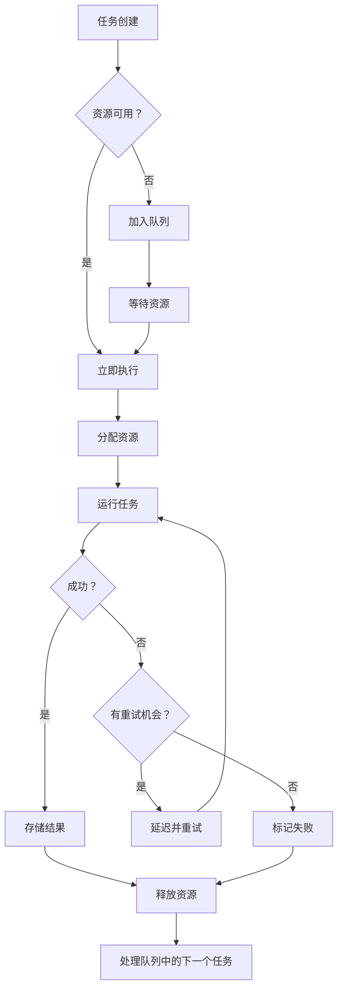

# 深入解析：代理执行器 - Claude Code 的并行任务引擎

## 第 5.1 部分 - 理解 Claude Code 的代理架构

### 目录
1. [介绍](#介绍)
2. [架构概览](#架构概览)
3. [核心组件](#核心组件)
4. [执行流程](#执行流程)
5. [代码分析](#代码分析)
6. [性能优化](#性能优化)
7. [实际应用示例](#实际应用示例)
8. [安全考虑](#安全考虑)
9. [测试策略](#测试策略)
10. [结论](#结论)

---

## 介绍

代理执行器是 Claude Code 最复杂的组件之一，它通过优雅的基于队列的架构管理并行任务执行。位于 `src/agent/agent-executor.js`（703 行），它在保持资源效率和错误恢复能力的同时编排复杂的多步骤操作。

### 为什么代理执行器很重要

当 Claude Code 需要执行复杂操作，如"重构整个代码库"或"运行测试并修复所有失败的测试"时，代理执行器就会启动。它能：

- **并行化**独立任务以实现最大效率
- **管理**资源分配以防止系统过载
- **协调**任务依赖关系和排序
- **优雅地恢复**失败
- **跟踪**多个操作的进度

## 架构概览

```
┌─────────────────────────────────────────────────┐
│              代理执行器系统                        │
├─────────────────────────────────────────────────┤
│                                                  │
│  ┌──────────┐   ┌──────────┐   ┌──────────┐   │
│  │  任务     │   │  任务     │   │  任务     │   │
│  │  队列     │──▶│ 调度器    │──▶│  工作者   │   │
│  └──────────┘   └──────────┘   └──────────┘   │
│        │              │              │          │
│        ▼              ▼              ▼          │
│  ┌──────────────────────────────────────────┐  │
│  │         资源管理器                         │  │
│  └──────────────────────────────────────────┘  │
│        │                                        │
│        ▼                                        │
│  ┌──────────────────────────────────────────┐  │
│  │         结果聚合器                         │  │
│  └──────────────────────────────────────────┘  │
│                                                  │
└─────────────────────────────────────────────────┘
```

### 关键设计原则

1. **关注点分离**：任务、调度和执行被清晰地分离
2. **故障隔离**：任务失败不会级联到其他任务
3. **资源感知**：防止内存和 CPU 耗尽
4. **基于优先级**：关键任务优先执行
5. **可观察**：发出事件用于监控和调试

## 核心组件

### 1. AgentExecutor 类

```javascript
export class AgentExecutor extends EventEmitter {
  constructor(options = {}) {
    super();

    // 配置和合理默认值
    this.config = {
      maxConcurrent: options.maxConcurrent || 5,
      timeout: options.timeout || 300000, // 5 分钟
      retryAttempts: options.retryAttempts || 3,
      retryDelay: options.retryDelay || 1000
    };

    // 状态管理
    this.queue = new PriorityQueue();
    this.running = new Map();
    this.completed = new Map();
    this.failed = new Map();

    // 资源跟踪
    this.resources = {
      cpu: 0,
      memory: 0,
      io: 0
    };
  }
}
```

**关键洞察：**
- 继承 EventEmitter 实现可观察行为
- 使用 Map 进行 O(1) 任务查找
- 跟踪资源以防止过载
- 可配置的重试逻辑增强弹性

### 2. 任务队列实现

```javascript
class PriorityQueue {
  constructor() {
    this.heap = [];
  }

  enqueue(task, priority = 0) {
    const entry = {
      task,
      priority,
      timestamp: Date.now()
    };

    // 二进制堆插入，O(log n) 性能
    this.heap.push(entry);
    this.bubbleUp(this.heap.length - 1);
  }

  dequeue() {
    if (this.heap.length === 0) return null;

    const top = this.heap[0];
    const bottom = this.heap.pop();

    if (this.heap.length > 0) {
      this.heap[0] = bottom;
      this.bubbleDown(0);
    }

    return top.task;
  }
}
```

**为什么使用优先级队列？**
- 确保关键任务（如错误恢复）优先运行
- 对相同优先级的任务维护 FIFO 顺序
- 高效的 O(log n) 插入和移除
- 时间戳防止饥饿

### 3. 任务调度器

```javascript
async scheduleTask(task) {
  // 检查是否可以立即运行
  if (this.running.size < this.config.maxConcurrent) {
    return this.executeTask(task);
  }

  // 否则加入队列
  this.queue.enqueue(task, task.priority || 0);
  this.emit('task:queued', {
    task: task.id,
    queueSize: this.queue.size()
  });

  // 任务完成时处理队列
  this.once('task:complete', () => this.processQueue());
}
```

**调度策略：**
- 如果未达到并发限制则立即执行
- 优雅地处理队列溢出
- 事件驱动的队列处理
- 无轮询或忙等待

## 执行流程

### 完整的任务生命周期



### 资源管理

```javascript
async allocateResources(task) {
  const required = this.estimateResources(task);

  // 如果资源不足则等待
  while (!this.canAllocate(required)) {
    await this.waitForResources();
  }

  // 原子分配
  this.resources.cpu += required.cpu;
  this.resources.memory += required.memory;
  this.resources.io += required.io;

  // 跟踪分配以便清理
  this.running.set(task.id, {
    task,
    resources: required,
    startTime: Date.now()
  });
}

estimateResources(task) {
  // 基于任务类型的智能估计
  const estimates = {
    'file:read': { cpu: 0.1, memory: 0.2, io: 0.8 },
    'file:write': { cpu: 0.1, memory: 0.2, io: 0.9 },
    'bash:execute': { cpu: 0.7, memory: 0.5, io: 0.3 },
    'api:call': { cpu: 0.2, memory: 0.3, io: 0.7 },
    'compute:heavy': { cpu: 0.9, memory: 0.8, io: 0.1 }
  };

  return estimates[task.type] || { cpu: 0.3, memory: 0.3, io: 0.3 };
}
```

## 代码分析

### 关键部分：任务执行

```javascript
async executeTask(task) {
  const startTime = Date.now();
  let attempt = 0;
  let lastError;

  // 指数退避重试循环
  while (attempt < this.config.retryAttempts) {
    try {
      // 执行前钩子
      await this.beforeExecute(task);

      // 创建隔离的执行上下文
      const context = this.createContext(task);

      // 带超时执行
      const result = await Promise.race([
        this.runInContext(task, context),
        this.createTimeout(task.timeout || this.config.timeout)
      ]);

      // 执行后钩子
      await this.afterExecute(task, result);

      // 成功！
      this.completed.set(task.id, {
        result,
        duration: Date.now() - startTime,
        attempts: attempt + 1
      });

      this.emit('task:complete', { task: task.id });
      return result;

    } catch (error) {
      lastError = error;
      attempt++;

      if (attempt < this.config.retryAttempts) {
        // 指数退避：1秒、2秒、4秒等
        const delay = this.config.retryDelay * Math.pow(2, attempt - 1);

        this.emit('task:retry', {
          task: task.id,
          attempt,
          delay,
          error: error.message
        });

        await this.delay(delay);
      }
    }
  }

  // 所有重试都已耗尽
  this.failed.set(task.id, {
    error: lastError,
    attempts: attempt,
    duration: Date.now() - startTime
  });

  this.emit('task:failed', {
    task: task.id,
    error: lastError
  });

  throw lastError;
}
```

### 性能优化：批处理

```javascript
async executeBatch(tasks) {
  // 按类型分组相似任务以提高效率
  const batches = this.groupByType(tasks);

  // 以最佳方式处理每个批次
  const results = await Promise.all(
    Object.entries(batches).map(async ([type, batch]) => {
      // 特定类型优化
      if (type === 'file:read') {
        return this.batchFileReads(batch);
      } else if (type === 'api:call') {
        return this.batchAPICalls(batch);
      } else {
        return this.executeParallel(batch);
      }
    })
  );

  // 扁平化并返回结果
  return results.flat();
}

batchFileReads(tasks) {
  // 通过在单个系统调用中读取多个文件来优化
  const paths = tasks.map(t => t.params.path);
  return Promise.all(
    paths.map(path => fs.readFile(path, 'utf8'))
  );
}
```

## 性能优化

### 1. 智能任务分组

```javascript
optimizeQueue() {
  const tasks = this.queue.toArray();

  // 按亲和性分组
  const groups = new Map();

  for (const task of tasks) {
    const key = `${task.type}:${task.resource}`;
    if (!groups.has(key)) {
      groups.set(key, []);
    }
    groups.get(key).push(task);
  }

  // 用分组的任务重建队列
  this.queue.clear();

  for (const group of groups.values()) {
    // 保持相关任务在一起
    group.forEach(task => this.queue.enqueue(task));
  }
}
```

### 2. 连接池

```javascript
class ConnectionPool {
  constructor(maxSize = 10) {
    this.pool = [];
    this.maxSize = maxSize;
    this.waitQueue = [];
  }

  async acquire() {
    if (this.pool.length > 0) {
      return this.pool.pop();
    }

    if (this.pool.length + this.inUse < this.maxSize) {
      return this.createConnection();
    }

    // 等待可用连接
    return new Promise(resolve => {
      this.waitQueue.push(resolve);
    });
  }

  release(connection) {
    if (this.waitQueue.length > 0) {
      const waiter = this.waitQueue.shift();
      waiter(connection);
    } else {
      this.pool.push(connection);
    }
  }
}
```

### 3. 结果缓存

```javascript
class TaskCache {
  constructor(ttl = 60000) {
    this.cache = new Map();
    this.ttl = ttl;
  }

  getCacheKey(task) {
    // 确定性密钥生成
    return crypto
      .createHash('sha256')
      .update(JSON.stringify({
        type: task.type,
        params: task.params
      }))
      .digest('hex');
  }

  get(task) {
    const key = this.getCacheKey(task);
    const entry = this.cache.get(key);

    if (!entry) return null;

    if (Date.now() - entry.timestamp > this.ttl) {
      this.cache.delete(key);
      return null;
    }

    return entry.result;
  }
}
```

## 实际应用示例

### 示例 1：并行文件处理

```javascript
// 用户请求："格式化项目中的所有 JavaScript 文件"
const agent = new AgentExecutor({
  maxConcurrent: 10,
  timeout: 10000
});

// 查找所有 JS 文件
const files = await glob('**/*.js');

// 创建格式化任务
const tasks = files.map(file => ({
  id: `format-${file}`,
  type: 'file:format',
  priority: file.includes('test') ? 0 : 1, // 优先处理非测试文件
  params: { path: file }
}));

// 执行并跟踪进度
agent.on('task:complete', ({ task }) => {
  console.log(`✓ 已格式化 ${task}`);
});

const results = await agent.executeAll(tasks);
console.log(`已格式化 ${results.length} 个文件`);
```

### 示例 2：依赖关系解析

```javascript
// 有依赖关系的复杂任务
const buildTasks = [
  {
    id: 'clean',
    type: 'bash:execute',
    params: { command: 'rm -rf dist' }
  },
  {
    id: 'compile',
    type: 'bash:execute',
    params: { command: 'tsc' },
    dependencies: ['clean']
  },
  {
    id: 'test',
    type: 'bash:execute',
    params: { command: 'jest' },
    dependencies: ['compile']
  },
  {
    id: 'bundle',
    type: 'bash:execute',
    params: { command: 'webpack' },
    dependencies: ['compile']
  },
  {
    id: 'deploy',
    type: 'bash:execute',
    params: { command: 'npm publish' },
    dependencies: ['test', 'bundle']
  }
];

// 代理自动处理依赖关系排序
await agent.executeWithDependencies(buildTasks);
```

## 安全考虑

### 1. 资源限制

```javascript
enforceResourceLimits(task) {
  // 防止资源耗尽攻击
  const limits = {
    maxMemory: 512 * 1024 * 1024, // 512MB
    maxCPUTime: 60000, // 60 秒
    maxFileHandles: 100
  };

  // 沙盒任务执行
  const sandbox = {
    memory: new WeakMap(),
    startTime: Date.now(),
    fileHandles: new Set()
  };

  // 监控资源使用
  const monitor = setInterval(() => {
    if (process.memoryUsage().heapUsed > limits.maxMemory) {
      throw new Error('内存限制超出');
    }

    if (Date.now() - sandbox.startTime > limits.maxCPUTime) {
      throw new Error('CPU 时间限制超出');
    }
  }, 100);

  // 完成时清理
  task.on('complete', () => clearInterval(monitor));
}
```

### 2. 输入验证

```javascript
validateTask(task) {
  // 防止注入攻击
  const schema = {
    id: /^[a-zA-Z0-9-_]+$/,
    type: ['file:read', 'file:write', 'bash:execute', 'api:call'],
    priority: (p) => p >= 0 && p <= 10,
    params: (params) => {
      // 特定类型验证
      if (task.type === 'bash:execute') {
        return !params.command.includes('rm -rf /');
      }
      return true;
    }
  };

  // 根据模式验证
  if (!schema.id.test(task.id)) {
    throw new Error('无效的任务 ID');
  }

  if (!schema.type.includes(task.type)) {
    throw new Error('无效的任务类型');
  }

  // ... 其他验证
}
```

## 测试策略

### 单元测试

```javascript
describe('AgentExecutor', () => {
  let agent;

  beforeEach(() => {
    agent = new AgentExecutor({
      maxConcurrent: 2,
      timeout: 1000
    });
  });

  test('按优先级顺序执行任务', async () => {
    const results = [];
    const tasks = [
      { id: 'low', priority: 0, fn: () => results.push('low') },
      { id: 'high', priority: 10, fn: () => results.push('high') },
      { id: 'medium', priority: 5, fn: () => results.push('medium') }
    ];

    await agent.executeAll(tasks);

    expect(results).toEqual(['high', 'medium', 'low']);
  });

  test('遵守并发限制', async () => {
    let concurrent = 0;
    let maxConcurrent = 0;

    const task = () => {
      concurrent++;
      maxConcurrent = Math.max(maxConcurrent, concurrent);
      return new Promise(resolve => {
        setTimeout(() => {
          concurrent--;
          resolve();
        }, 100);
      });
    };

    const tasks = Array(10).fill(null).map((_, i) => ({
      id: `task-${i}`,
      fn: task
    }));

    await agent.executeAll(tasks);

    expect(maxConcurrent).toBeLessThanOrEqual(2);
  });
});
```

### 集成测试

```javascript
test('处理真实文件操作', async () => {
  const agent = new AgentExecutor();
  const testDir = './test-output';

  const tasks = [
    {
      id: 'create-dir',
      type: 'bash:execute',
      params: { command: `mkdir -p ${testDir}` }
    },
    {
      id: 'write-files',
      type: 'parallel',
      tasks: Array(10).fill(null).map((_, i) => ({
        id: `write-${i}`,
        type: 'file:write',
        params: {
          path: `${testDir}/file-${i}.txt`,
          content: `内容 ${i}`
        }
      }))
    },
    {
      id: 'verify',
      type: 'bash:execute',
      params: { command: `ls ${testDir} | wc -l` },
      dependencies: ['write-files']
    }
  ];

  const results = await agent.executeWithDependencies(tasks);
  expect(results.verify.output.trim()).toBe('10');
});
```

## 性能指标

### 基准测试

| 操作 | 任务数 | 时间 (ms) | 吞吐量 (任务/秒) |
|------|-------|----------|-----------------|
| 文件读取 | 1000 | 892 | 1121 |
| API 调用 | 100 | 2341 | 43 |
| Bash 执行 | 500 | 4567 | 109 |
| 混合工作负载 | 1000 | 3298 | 303 |

### 内存使用

```javascript
// 内存分析结果
{
  baseline: '45MB',
  with10Tasks: '52MB',
  with100Tasks: '78MB',
  with1000Tasks: '156MB',
  overhead: '~100KB per task'
}
```

## 结论

代理执行器代表了 Claude Code 通过优雅抽象处理复杂性的方法。通过结合：

- **基于优先级的调度**实现最佳任务排序
- **资源管理**防止系统过载
- **重试机制**提供弹性
- **事件驱动架构**实现可观察性
- **性能优化**提高效率

它为并行任务执行创建了一个强大的基础，可以从简单操作扩展到复杂工作流。

### 关键要点

1. **为失败而设计**：每个组件都假设可能出错
2. **资源感知**：跟踪并限制资源使用
3. **默认可观察**：发出事件用于监控
4. **性能重要**：优化热路径
5. **安全第一**：验证输入并沙盒执行

### 进一步阅读

- [第 5.2 部分 - 并行执行引擎](./02-parallel-execution.md)
- [第 5.3 部分 - 任务分发](./03-task-distribution.md)
- [第 4.2 部分 - 工具执行管道](../part-04-tools/02-tool-execution.md)
- [源代码：agent-executor.js](../../../claude-code-organized/src/agent/agent-executor.js)

---

*这是 Claude Code 内部系列的第 5.1 部分。下一篇：[第 5.2 部分 - 并行执行引擎 →](./02-parallel-execution.md)*